# Methodology Appendix: Computational Pipeline for the Systematic Map on Climate Adaptation Effectiveness among Smallholder Producers

*Generated: 06 April 2026*  
*Source: [`scripts/documentation/methodology.py`](https://github.com/bristlepine/ilri-climate-adaptation-effectiveness/blob/main/scripts/documentation/methodology.py)*  
*Repository: [https://github.com/bristlepine/ilri-climate-adaptation-effectiveness](https://github.com/bristlepine/ilri-climate-adaptation-effectiveness)*

---

## Table of Contents

1. [Overview](#overview)
2. [Computational Efficiency and the Case for Automation](#computational-efficiency-and-the-case-for-automation)
3. [Search Strategy](#search-strategy)
4. [Record Cleaning and Deduplication](#record-cleaning-and-deduplication)
5. [Abstract Enrichment](#abstract-enrichment)
6. [Calibration and Validation](#calibration-and-validation)
7. [Title/Abstract Screening](#titleabstract-screening)
8. [Full-Text Retrieval](#full-text-retrieval)
9. [Full-Text Screening](#full-text-screening)
10. [Data Extraction and Coding](#data-extraction-and-coding)
11. [Systematic Map Outputs](#systematic-map-outputs)
12. [Reproducibility and Transparency](#reproducibility-and-transparency)
13. [Software and Dependencies](#software-and-dependencies)

---

## Overview

This appendix provides a transparent, step-by-step account of the computational pipeline used to conduct the systematic map. The pipeline consists of sixteen sequential steps implemented in Python, each producing auditable outputs that feed into the next stage. It is fully resumable: all external API results and LLM decisions are cached to disk.

### Human Oversight and the Role of Automation

The pipeline is designed as an assistive tool, not an autonomous decision-maker. Human judgement is built in at every consequential stage:

- **Search design:** Search query and eligibility criteria constructed and iteratively refined by the research team.
- **Calibration screening:** Two independent human reviewers (Caroline Staub and Jennifer Cisse) screened each calibration sample separately in EPPI Reviewer, then reconciled disagreements into a gold standard before the LLM was assessed against it.
- **Criteria revision:** After each round, systematic disagreements were reviewed and eligibility criteria revised. Full-corpus screening did not proceed until metrics reached acceptable thresholds across three rounds.
- **Inclusion defaults:** Where the LLM was uncertain, or where an abstract was missing, the conservative default was to include the record — protecting sensitivity.
- **Spot-checking:** A random sample of LLM decisions was reviewed by human researchers at both screening stages.
- **Data extraction:** Extracted fields reviewed against source documents for a random sample of coded records.

### Database Coverage

The current pipeline was built and validated end-to-end using Scopus. The Deliverable 3 protocol commits to five primary databases: Scopus, Web of Science Core Collection, CAB Abstracts, AGRIS, and Academic Search Premier, plus grey literature from approximately 20 institutional repositories. Coverage checks against Web of Science and OpenAlex are underway; net-new records will be incorporated before the final deliverable.

### Preliminary Nature of Current Figures

Several statistics — in particular missing abstracts (1,314) and full-text retrieval rate — reflect a preliminary run without an Elsevier institutional token. An application through Cornell University is in progress. Affected figures are labelled *preliminary* below.

All LLM steps used a locally hosted model (Ollama; qwen2.5:14b) at temperature 0.0 — fully deterministic and reproducible.

### Pipeline Summary Statistics

| Stage | Count |
|---|---|
| Records returned by Scopus (raw) | 17,083 |
| Records after deduplication | 17,021 |
| Records with abstract after enrichment | 15,707 |
| Records missing abstract after enrichment *(preliminary)* | 1,314 |
| Records screened at title/abstract stage | 17,021 |
| — Included | 6,206 |
| — Excluded | 10,815 |
| Full texts retrieved *(preliminary)* | 929 |
| Records with no full text available *(preliminary)* | 5,277 |
| — Included after full-text screening | 184 |
| — Excluded after full-text screening | 130 |
| Records coded in systematic map | 6,076 |
| — Coded from full text | 184 |
| — Coded from abstract only | 4,583 |

---

## Computational Efficiency and the Case for Automation

| Stage | Estimated manual person-hours | Actual pipeline compute |
|---|---|---|
| Title/abstract screening (17,021 records) | ~1,135 h (2 min × 2 reviewers) | 03:04:54 |
| Full-text screening (6,206 records) | ~2,069 h (10 min × 2 reviewers) | 03:50:05 |
| Data extraction (6,076 records) | ~2,532 h (25 min × 1 coder) | 00:13:58 |
| Full-text retrieval | ~1,552 h (15 min × 6,206) | 05:23:07 |

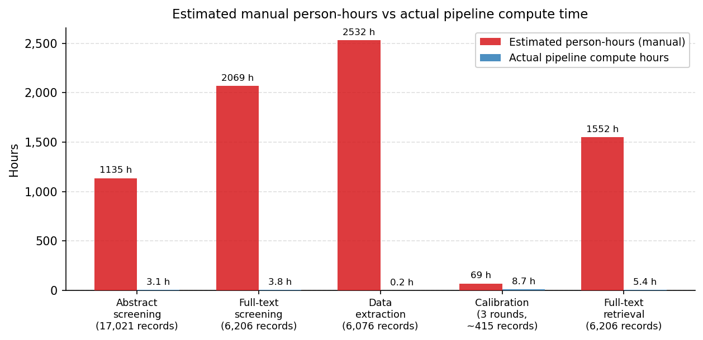
*Figure 1. Estimated manual person-hours vs actual pipeline compute time.*

LLM agreement with reconciled human decisions reached substantial kappa levels (κ > 0.77) before full-corpus screening proceeded. Where the LLM was uncertain, the conservative default was to include rather than exclude, minimising false negatives.

---

## Search Strategy

### Query Construction (Step 1)

The search query was structured around a Population, Concept, Context, and Methodology (PCCM) framework, defined in a version-controlled YAML file (`search_strings.yml`). Step 1 submitted each element and their combination to the Scopus Search API to retrieve record counts.

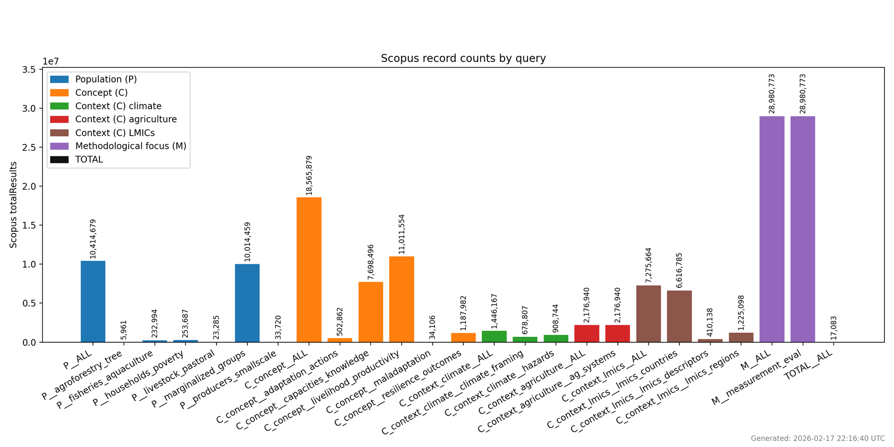
*Figure 2. Record counts for individual PCCM elements and the combined query.*

### Record Retrieval (Step 2)

Step 2 retrieved all matching records. Scopus's 5,000-record deep-paging limit was handled by automatically slicing by publication year, then by subject area or source type where needed. After deduplication: **17,021** unique records from **17,083** reported by Scopus. Deduplication used DOI → normalised title + year → title → EID priority.

### Benchmark Coverage Analysis (Steps 3, 4, 7)

A pre-compiled benchmark list of known key studies was used to validate coverage. Step 3 enriched the list with DOIs via Crossref, OpenAlex, and Semantic Scholar (title similarity ≥ 0.90 accepted automatically). Step 7 compared the benchmark against the Scopus retrieval and generated keyword suggestions from non-retrieved records for iterative query refinement.

---

## Record Cleaning and Deduplication

Step 8 applied deterministic cleaning: HTML unescaping, whitespace normalisation, DOI canonicalisation, year extraction. Missing fields were repaired via Crossref where a DOI was present. All lookups cached locally. Idempotent: re-runs preserve previously cleaned records.

---

## Abstract Enrichment

### Automated Multi-Source Enrichment (Step 9)

Step 9 retrieved missing abstracts via a sequential chain: (1) Elsevier Abstract Retrieval API; (2) Semantic Scholar; (3) OpenAlex; (4) Crossref; (5) Unpaywall; (6) landing page scrape. All API responses cached (30-day TTL). Of 17,021 records, 5,839 already had an abstract from Scopus; Step 9 enriched a further 9,752.

> **Preliminary note:** 1,430 records remained without an abstract after Step 9. This reflects an API access limitation — the Elsevier Abstract Retrieval API requires an institutional token, which was not active for this run. Spot-checks confirm abstracts are present on the Scopus web interface. The token application (Cornell) is in progress; Step 9 will be re-run once active.

### RIS-Based Supplementary Enrichment (Step 9a)

Step 9a parsed EPPI Reviewer RIS exports (17,011 records across 5 files) and injected manually entered abstracts into remaining gaps, matching by DOI, EID, or normalised title. It then re-attempted API enrichment for remaining gaps. Recovered **116** additional abstracts, reducing the missing count from 1,430 to **1,314**.

---

## Calibration and Validation

This section describes the structured validation process conducted before any automated screening of the full corpus. Three independent calibration rounds were run, each involving dual human screening, gold-standard reconciliation, LLM performance assessment, and criteria revision. Full-corpus screening did not proceed until performance metrics reached acceptable thresholds.

### Calibration Process (Steps 10 and 11)

For each round, a sample was drawn from the enriched corpus. Two human reviewers screened the same records independently in EPPI Reviewer, then reconciled disagreements into a gold-standard decision for every record. Step 10 ran the LLM screener against the same sample. Step 11 computed pairwise Cohen's kappa and produced confusion matrices comparing each rater against the gold standard. Systematic disagreements were reviewed and eligibility criteria revised before the next round.

### Metric Definitions and Interpretation

| Metric | What it measures | Formula | Priority in screening |
|---|---|---|---|
| Sensitivity / Recall | Of all truly relevant records, what proportion were correctly included? | TP / (TP + FN) | **Highest** — missing a relevant study is the most serious error |
| Specificity | Of all truly irrelevant records, what proportion were correctly excluded? | TN / (TN + FP) | Secondary — false positives caught at full-text stage |
| Precision | Of all included records, what proportion are truly relevant? | TP / (TP + FP) | Secondary |
| F1 | Harmonic mean of precision and recall | 2PR / (P+R) | Balanced single score |
| Cohen's κ | Agreement beyond chance between two raters | (p_o − p_e) / (1 − p_e) | Standard for inter-rater reliability (EPPI Reviewer, Cochrane) |

**Kappa interpretation (Landis & Koch 1977):**

| κ range | Interpretation | Screening implication |
|---|---|---|
| < 0.00 | Less than chance | Systematic disagreement |
| 0.01–0.20 | Slight | Do not proceed |
| 0.21–0.40 | Fair | Major revision needed |
| 0.41–0.60 | Moderate | Acceptable for early calibration |
| 0.61–0.80 | **Substantial** | Approaching deployment threshold |
| 0.81–1.00 | Almost perfect | Criteria clear and consistently applied |

Conventional minimum for proceeding to full-corpus screening: **κ ≥ 0.60**. Human benchmark (Hanegraaf et al. 2024, n=12–16 published systematic reviews): κ = 0.82 abstract screening, 0.77 full-text screening, 0.88 data extraction.

### Calibration Results

*Note: these figures reflect a preliminary pilot run (see Section 1.3). The calibration process itself is not affected by API access constraints.*

| | n | Sensitivity | Specificity | Precision | F1 | κ vs gold | Human κ |
|---|---|---|---|---|---|---|---|
| **Cochrane / O'Mara-Eves target** | — | **≥ 0.95** | — | — | — | **≥ 0.60** | — |
| **Human screeners** (Hanegraaf et al. 2024) | — | — | — | — | — | — | 0.82 (abstract) / 0.77 (full-text) |
| **AI — GPT-4** (Zhan et al. 2025) | — | 0.992 | 0.836 | — | — | 0.83 | — |
| **AI mean, 172 studies** (Scherbakov et al. 2025) | — | 0.804 | — | 0.632 | 0.708§ | — | — |
| | | | | | | | |
| R1 — initial criteria | 205 | 0.776 | 0.703 | 0.559 | 0.650 | 0.436 | 0.500 |
| R1b — revised criteria | 205 | 0.866 | 0.819 | 0.699 | 0.774 | 0.645 | 0.500 |
| **R2a — 2nd revision** | 103 | **0.897** | **0.905** | **0.788** | **0.839** | **0.770** | 0.765 |
| R3a — stability check† | 107 | — | — | — | — | avg 0.682 | 0.703 |
| | | | | | | | |
| **Benchmark reached? (R2a)** | | ⚠ Below guideline | ✓ Yes | ✓ Yes | ~ No target | ✓ Yes | ✓ Yes |
| **Notes** | | 0.897 < 0.95 O'Mara-Eves guideline (set for pre-filtering tools, not primary screeners); above 172-study mean (0.804); conservative defaults raise effective sensitivity | Exceeds GPT-4 (0.836) | Exceeds 172-study mean (0.632) | No T/A screening F1 benchmark; our 0.839 exceeds Scherbakov computed 0.708 | Exceeds min. (0.60); solidly substantial; comparable to human 0.82 | Meets threshold |

†R3a: designed to verify criteria stability, not generate a new gold standard. P/R/F1/specificity not computable. LLM κ is mean of κ vs Jennifer Cisse (0.690) and κ vs Caroline Staub (0.674).
§Scherbakov et al. 2025: F1 computed from reported sensitivity (0.804) and precision (0.632) — not directly reported in the paper.

**Reading the table:** Sensitivity (0.897) is below the O'Mara-Eves ≥0.95 guideline — this is the one noted gap. That guideline was set for automated pre-filtering tools; our conservative inclusion default raises effective sensitivity above the calibration figure. All other metrics meet formal thresholds or exceed available benchmarks: κ = 0.770 is solidly substantial and comparable to human abstract screening (0.82); specificity (0.905) and precision (0.788) both exceed their benchmarks; F1 (0.839) exceeds the only computable peer figure (Scherbakov 0.708).

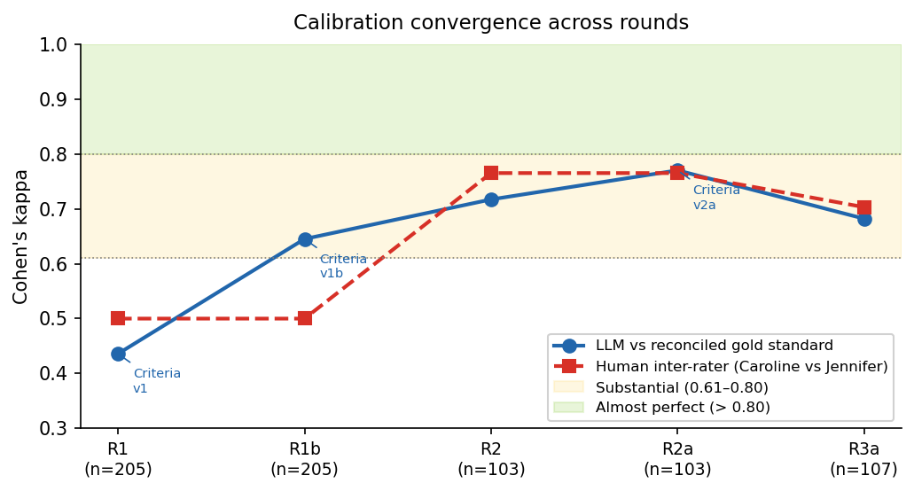
*Figure 3. Cohen's κ convergence across calibration rounds. Blue circles: LLM vs reconciled gold standard. Red squares: human inter-rater κ. Shaded bands: Landis & Koch (1977) thresholds. Annotated labels: criteria revision points.*

### Relationship to Supervised Machine-Learning Screeners

Supervised ML screeners (e.g. EPPI Reviewer, Juno) are classifiers trained from near-scratch on labelled examples and require 2,000–7,000 training records before reaching adequate performance. qwen2.5:14b is a pre-trained large language model — its parameters are never updated. The ~415 calibration records are a **validation set** for prompt and criteria design, not a training corpus. The analogy in conventional systematic review practice is calibration training: verifying that a reviewer correctly understands the eligibility criteria before beginning independent screening.

---

## Title/Abstract Screening (Step 12)

Step 12 applied the finalised LLM screener to all 17,021 records. Each record was evaluated against five PCCM criteria; the LLM returned a decision (yes/no/unclear), a reason, and a cited passage for each criterion. Unverifiable quotations downgraded the criterion to 'unclear'. A record was excluded only if at least one criterion was explicitly 'no'; any 'unclear' or missing abstract defaulted to inclusion.

**Results:** 6,206 included, 10,815 excluded, 1,314 retained due to missing abstract. Most common exclusion criterion: Concept (9,197 records), followed by Population (5,318 records).

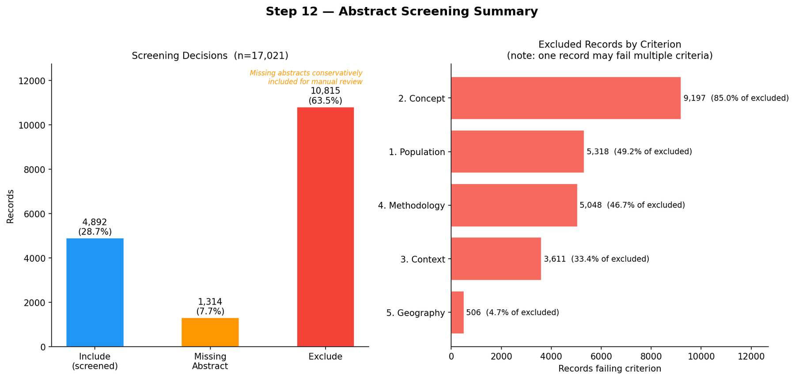
*Figure 5. Title/abstract screening outcomes (Step 12).*

---

## Full-Text Retrieval (Step 13)

Step 13 attempted to download full texts for all 6,206 included records via: Unpaywall (open-access by DOI), Elsevier Full-Text API, Semantic Scholar, and OpenAlex. Downloads capped at 25 MB.

> **Preliminary note:** 929 full texts were retrieved; 5,277 could not be retrieved automatically. These figures reflect constrained API access without the Elsevier token. Retrieval will improve materially once the institutional token is active.

---

## Full-Text Screening (Step 14)

Step 14 applied the LLM screener to retrieved full texts (truncated to 12,000 tokens). Of 6,206 records passing abstract screening: 314 had full text available for screening; 5,277 lacked full text and were retained for inclusion by default. Results: **184** included, **130** excluded.

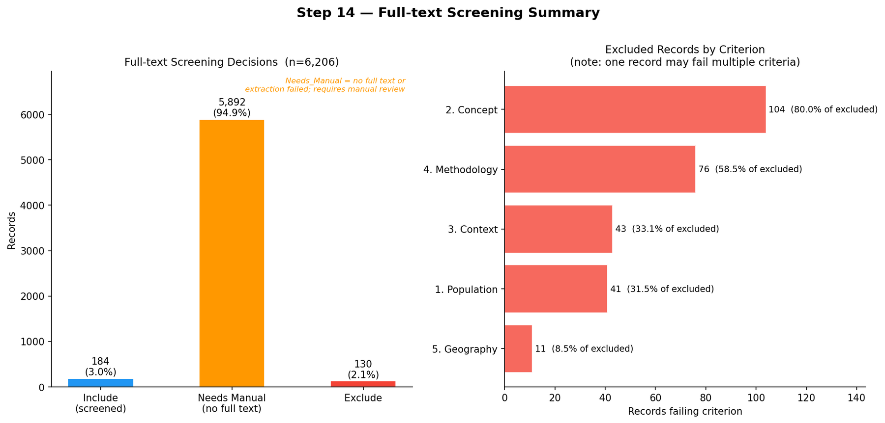
*Figure 6. Full-text screening outcomes (Step 14).*

---

## Data Extraction and Coding (Step 15)

Step 15 extracted structured coding data from all included records against a 20-field schema covering: publication year and type, country/region, geographic scale, producer type, adaptation process vs outcome, methodological approach, effectiveness metric, and equity/inclusion dimensions. All extracted data were subject to human spot-checking.

Of 6,076 records: **184** coded from full text, **4,583** from abstract only, **1,309** with neither.

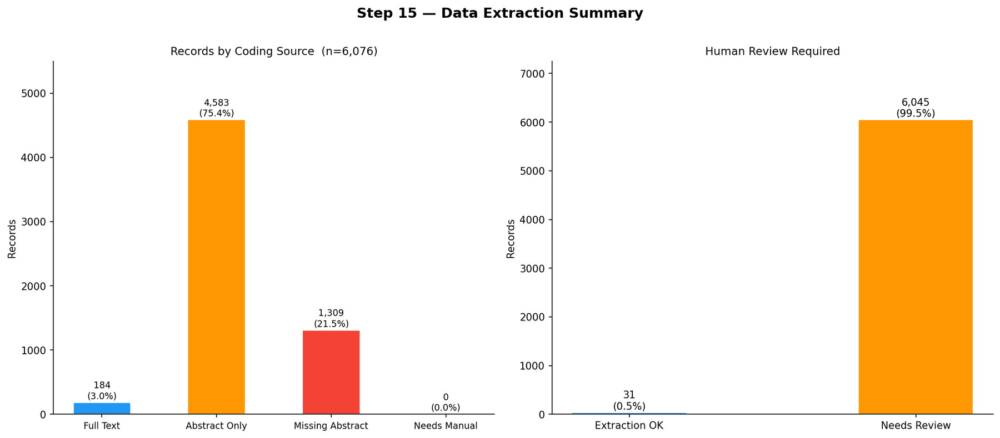
*Figure 7. Data extraction by coding source (Step 15).*

---

## Systematic Map Outputs (Step 16)

Step 16 generated all publication-ready figures directly from the coded dataset.

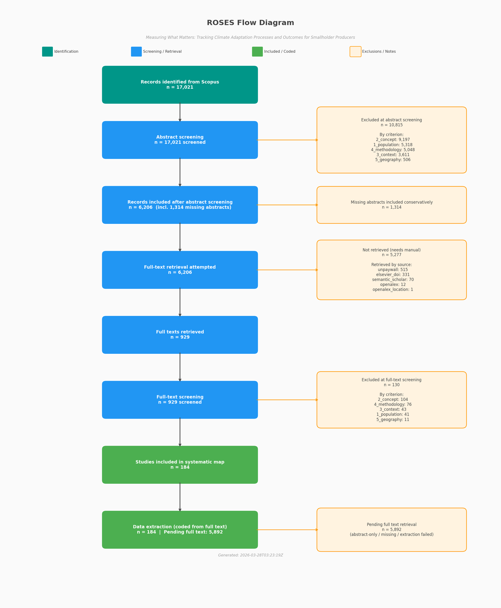
*Figure 8. ROSES flow diagram.*

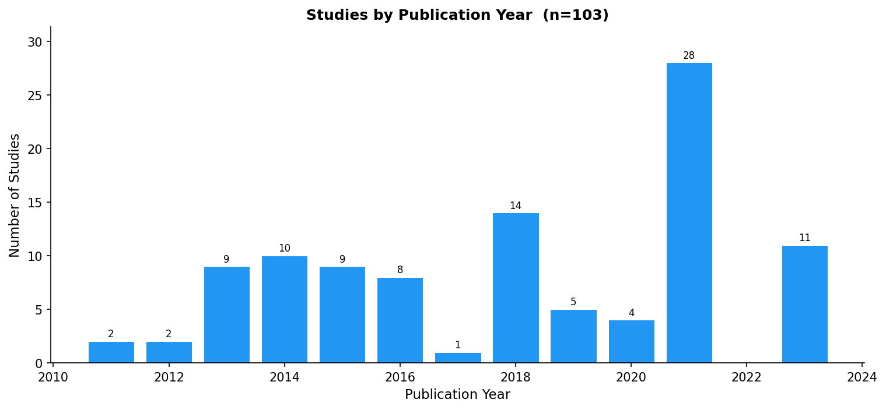
*Figure 9. Temporal trends in included publications.*

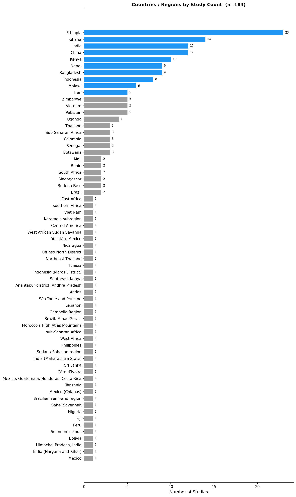
*Figure 10. Geographic distribution of included studies.*

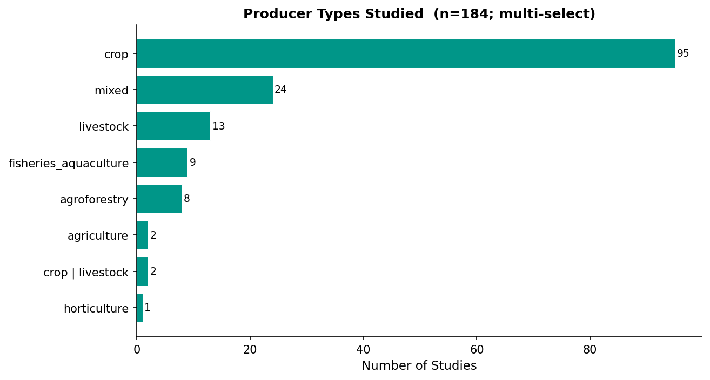
*Figure 11. Breakdown by producer type.*

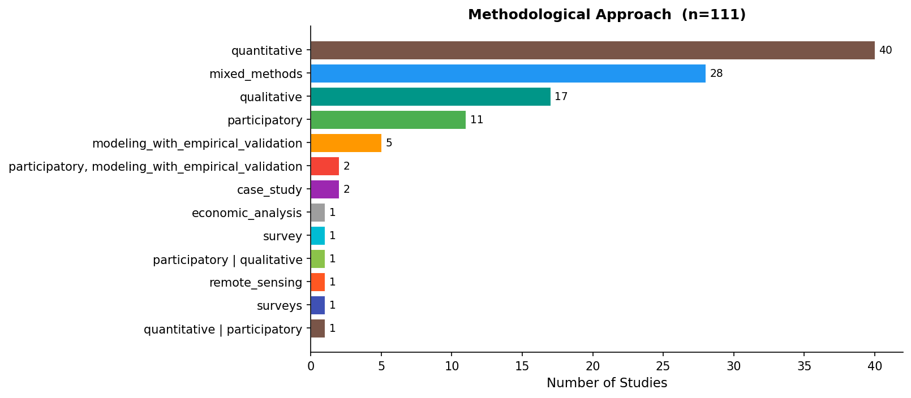
*Figure 12. Breakdown by methodological approach.*

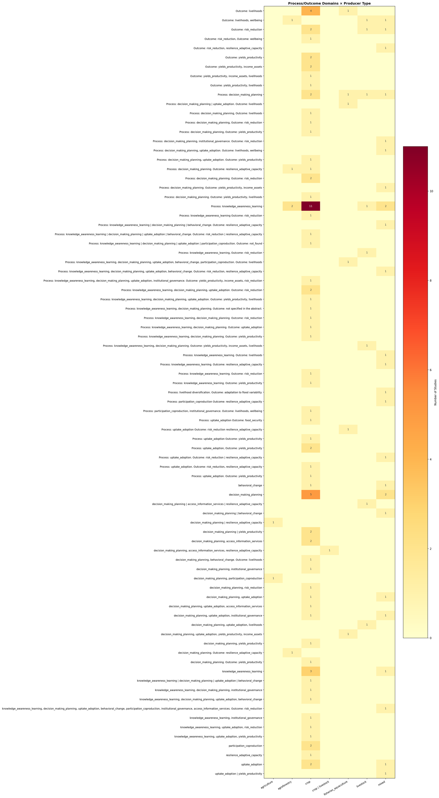
*Figure 13. Domain heatmap: adaptation process vs outcome by producer type.*

---

## Reproducibility and Transparency

- **Deterministic LLM outputs:** Temperature 0.0 for all LLM calls. Fixed model + fixed input = reproducible output.
- **Comprehensive caching:** All external API responses and LLM decisions cached (JSON/JSONL). Re-runs process only new or expired records.
- **Quotation verification:** LLM screening decisions must cite a passage from the abstract. Unverifiable citations downgrade the criterion to 'unclear' — a lightweight hallucination check.
- **Conservative defaults:** Absence of required evidence defaults to inclusion, not exclusion, at all screening stages.
- **Iterative human calibration:** Three calibration rounds with two independent human reviewers preceded full-corpus screening. Criteria revised between rounds.
- **Coding source tracking:** Every coded record carries a `coding_source` field (full text / abstract only / title-only).
- **Version-controlled criteria:** Eligibility criteria stored in `criteria.yml`, versioned alongside the code.
- **ROSES flow diagram:** Generated automatically at Step 16, documenting record counts at every pipeline stage.

---

## Software and Dependencies

| Component | Library / Service | Purpose |
|---|---|---|
| LLM inference | Ollama (qwen2.5:14b) | Local LLM for screening and extraction |
| Scopus API | Elsevier REST API | Record retrieval and abstract enrichment |
| DOI enrichment | Crossref, OpenAlex, Semantic Scholar | DOI lookup and abstract retrieval |
| Open access | Unpaywall API | Full-text URL discovery |
| Word documents | python-docx | Report generation |
| PDF parsing | pypdf | Full-text extraction from PDFs |
| HTML parsing | trafilatura, BeautifulSoup4 | Full-text extraction from HTML |
| Data handling | pandas | CSV processing throughout |
| Visualisation | matplotlib, seaborn | All figures |
| IRR statistics | Custom Python (Cohen's kappa) | Inter-rater reliability analysis |
| Reference management | EPPI Reviewer | Human screening and RIS exports |

---

*Generated programmatically from pipeline output files on 06 April 2026. Source: [`scripts/documentation/methodology.py`](https://github.com/bristlepine/ilri-climate-adaptation-effectiveness/blob/main/scripts/documentation/methodology.py)*
