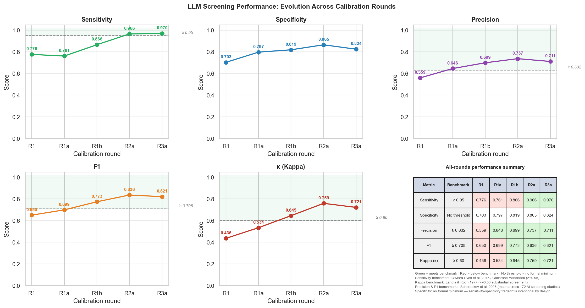

# Methodology Appendix: Computational Pipeline for the Systematic Map on Climate Adaptation Effectiveness among Smallholder Producers

*Generated: 06 April 2026*  
*Source: [`scripts/documentation/methodology.py`](https://github.com/bristlepine/ilri-climate-adaptation-effectiveness/blob/main/scripts/documentation/methodology.py)*  
*Repository: [https://github.com/bristlepine/ilri-climate-adaptation-effectiveness](https://github.com/bristlepine/ilri-climate-adaptation-effectiveness)*

---

## Table of Contents

1. [Overview](#overview)
2. [Computational Efficiency and the Case for Automation](#computational-efficiency-and-the-case-for-automation)
3. [Search Strategy](#search-strategy)
4. [Record Cleaning and Deduplication](#record-cleaning-and-deduplication)
5. [Abstract Enrichment](#abstract-enrichment)
6. [Calibration and Validation](#calibration-and-validation)
7. [Title/Abstract Screening](#titleabstract-screening)
8. [Full-Text Retrieval](#full-text-retrieval)
9. [Full-Text Screening](#full-text-screening)
10. [Data Extraction and Coding](#data-extraction-and-coding)
11. [Systematic Map Outputs](#systematic-map-outputs)
12. [Reproducibility and Transparency](#reproducibility-and-transparency)
13. [Software and Dependencies](#software-and-dependencies)

---

## Overview

This appendix provides a transparent, step-by-step account of the computational pipeline used to conduct the systematic map. The pipeline consists of sixteen sequential steps implemented in Python, each producing auditable outputs that feed into the next stage. It is fully resumable: all external API results and LLM decisions are cached to disk.

### Human Oversight and the Role of Automation

The pipeline is designed as an assistive tool, not an autonomous decision-maker. Human judgement is built in at every consequential stage:

- **Search design:** Search query and eligibility criteria constructed and iteratively refined by the research team.
- **Calibration screening:** Two independent human reviewers (Caroline Staub and Jennifer Cisse) screened each calibration sample separately in EPPI Reviewer, then reconciled disagreements into a gold standard before the LLM was assessed against it.
- **Criteria revision:** After each round, systematic disagreements were reviewed and eligibility criteria revised. Full-corpus screening did not proceed until metrics reached acceptable thresholds across three rounds.
- **Inclusion defaults:** Where the LLM was uncertain, or where an abstract was missing, the conservative default was to include the record — protecting sensitivity.
- **Spot-checking:** A random sample of LLM decisions was reviewed by human researchers at both screening stages.
- **Data extraction:** Extracted fields reviewed against source documents for a random sample of coded records.

### Database Coverage

All sources named in the Systematic Map Protocol (D3, §3) have been searched. Records from all sources are held as RIS files in `scripts/data/multidatabase/`. After deduplication against the Scopus corpus (Step 2b) and multi-pass abstract recovery (Step 4b), **9,152 net-new records** with 100% abstract coverage enter screening.

**Bibliographic databases (Protocol §3.1)**

| Source | Records | Abstracts |
|---|---|---|
| Scopus | 17,021 | 15,707 |
| Web of Science | 15,170 | 15,170 |
| CAB Abstracts | 5,723 | 5,723 |
| Academic Search Premier | 1,187 | 1,187 |
| EconLit | 478 | 478 |
| ProQuest | 367 | 367 |
| AGRIS | 3 | 3 |

**Web search engines (Protocol §3.2)**

| Source | Records | Abstracts |
|---|---|---|
| Google Scholar | 193 | 193 |
| DuckDuckGo | 3 | 3 |

**Organizational websites (Protocol §3.3)**

| Source | Records | Abstracts | PDFs |
|---|---|---|---|
| World Bank | 28 | 28 | 21 |
| GCF | 157 | 157 | — |
| GEF | 7 | 7 | 7 |
| IDB | 123 | 123 | 100 |
| ADB | 16 | 16 | 16 |
| AfDB | 5 | 5 | 7 |
| FCDO | 2 | 2 | 2 |
| USAID | 0 | — | — |
| FAO | 2 | 2 | — |
| IFAD | 16 | 16 | — |
| UNDP | 9 | 9 | — |
| UNEP | 2 | 2 | 1 |
| UNFCCC | 28 | 28 | 29 |
| CGSpace (CGIAR) | 65 | 65 | 69 |
| IPAM | 7 | 7 | 7 |
| Adaptation Research Alliance | 5 | 5 | — |
| GCA | 3 | 3 | 3 |
| WASP | 6 | 6 | 6 |
| 3ie | 5 | 5 | — |
| Campbell Collaboration | 3 | 3 | — |
| J-PAL | 0 | — | — |

Notes: USAID's Development Experience Clearinghouse (DEC) was taken offline in 2025 and could not be searched. J-PAL was searched with no relevant results. Records without recoverable abstracts were removed before deduplication: 9 WoS, 1 EconLit, 1 ProQuest, 5 Google Scholar, 3 IDB, 2 UNFCCC, 2 Campbell. RIS files were created from Google Scholar's CSV export and DuckDuckGo PDFs (no native RIS export available for either source).

### Preliminary Nature of Current Figures

Several statistics — in particular missing abstracts (1,314) and full-text retrieval rate — reflect a preliminary run without an Elsevier institutional token. An application through Cornell University is in progress. Affected figures are labelled *preliminary* below.

All LLM steps used a locally hosted model (Ollama; qwen2.5:14b) at temperature 0.0 — fully deterministic and reproducible.

### Pipeline Summary Statistics

**Scopus corpus**

| Stage | Count |
|---|---|
| Records returned by Scopus (raw) | 17,083 |
| Records after deduplication | 17,021 |
| Records with abstract after enrichment | 15,707 |
| Records missing abstract after enrichment *(preliminary)* | 1,314 |
| Records screened at title/abstract stage | 17,021 |
| — Included | 6,206 |
| — Excluded | 10,815 |
| Full texts retrieved | 2,644 |
| Records without full text (awaiting classification) | 3,574 |
| — Included after full-text screening | 184 |
| — Excluded after full-text screening | 130 |
| Records coded in systematic map | 6,076 |
| — Coded from full text | 184 |
| — Coded from abstract only | 4,583 |

**Additional databases (non-Scopus)**

| Stage | Count |
|---|---|
| Records retrieved across all additional sources | 23,613 |
| Net-new after deduplication against Scopus (Step 2b) | 9,152 |
| Records with abstract (after Step 4b recovery) | 9,152 |
| Abstract coverage | 100% |
| Records screened at title/abstract stage (Step 12b) | 9,152 |

---

## Computational Efficiency and the Case for Automation

| Stage | Estimated manual person-hours | Actual pipeline compute |
|---|---|---|
| Title/abstract screening (17,021 records) | ~1,135 h (2 min × 2 reviewers) | 03:04:54 |
| Full-text screening (6,206 records) | ~2,069 h (10 min × 2 reviewers) | 03:50:05 |
| Data extraction (6,076 records) | ~2,532 h (25 min × 1 coder) | 00:13:58 |
| Full-text retrieval | ~1,552 h (15 min × 6,206) | 05:23:07 |

*Figure 1. Estimated manual person-hours vs actual pipeline compute time.*

LLM agreement with reconciled human decisions reached substantial kappa levels (κ = 0.720) before full-corpus screening proceeded, with sensitivity of 0.966 meeting the O'Mara-Eves ≥0.95 threshold. Where the LLM was uncertain, the conservative default was to include rather than exclude, minimising false negatives.

---

## Search Strategy

### Query Construction (Step 1)

The search query was structured around a Population, Concept, Context, and Methodology (PCCM) framework, defined in a version-controlled YAML file (`search_strings.yml`). Step 1 submitted each element and their combination to the Scopus Search API to retrieve record counts.

*Figure 2. Record counts for individual PCCM elements and the combined query.*

### Record Retrieval (Step 2)

Step 2 retrieved all matching records. Scopus's 5,000-record deep-paging limit was handled by automatically slicing by publication year, then by subject area or source type where needed. After deduplication: **17,021** unique records from **17,083** reported by Scopus. Deduplication used DOI → normalised title + year → title → EID priority.

### Additional Database Search (Step 2b)

All 29 sources named in Protocol §3.1–3.3 outside Scopus were searched manually. Records were exported as RIS files (or, where no export was available, converted from CSV or extracted from PDFs). Searches were conducted using the same PCCM eligibility framework as the Scopus query. Retrieved records were loaded into the deduplication pipeline (Step 2b) to identify records not already present in the Scopus corpus.

**Results:** 23,613 records retrieved across all additional sources; **9,152 net-new** after deduplication against the Scopus corpus. All 9,152 entered abstract screening with 100% abstract coverage after multi-pass recovery (Step 4b).

### Benchmark Coverage Analysis (Steps 3, 4, 7)

A pre-compiled benchmark list of known key studies was used to validate coverage. Step 3 enriched the list with DOIs via Crossref, OpenAlex, and Semantic Scholar (title similarity ≥ 0.90 accepted automatically). Step 7 compared the benchmark against the Scopus retrieval and generated keyword suggestions from non-retrieved records for iterative query refinement.

---

## Record Cleaning and Deduplication

Deduplication occurs at two stages: first within the Scopus corpus (Step 8), then across all additional databases against the Scopus corpus (Step 2b).

### Within-Scopus Deduplication (Step 8)

Step 8 applied deterministic cleaning to the Scopus corpus: HTML unescaping, whitespace normalisation, DOI canonicalisation, year extraction. Missing fields were repaired via Crossref where a DOI was present. All lookups cached locally. Within-corpus duplicates were identified using DOI → normalised title + year → EID priority, reducing 17,083 raw Scopus records to **17,021** unique records.

### Cross-Database Deduplication (Step 2b)

After all additional databases were searched (see Database Coverage above), records from every non-Scopus source were loaded and deduplicated against the Scopus corpus. This step determines which records are genuinely *net-new* — not already present in the Scopus corpus — and therefore require screening.

**Sources included in Step 2b:**

All 29 protocol-required sources outside Scopus: Web of Science, CAB Abstracts, AGRIS, Academic Search Premier, EconLit, ProQuest, Google Scholar, DuckDuckGo, and all 21 organisational website sources (UN agencies, development agencies, international research centres, and M&E networks).

**Deduplication logic (applied in priority order):**

| Step | Method | Notes |
|---|---|---|
| 1 | DOI match | DOIs normalised to bare form (lowercased, URL prefix stripped) |
| 2 | Exact title + year | Title lowercased, punctuation stripped, whitespace collapsed |
| 3 | Fuzzy title match within year | Jaccard token overlap ≥ 0.85; skipped for titles with fewer than 4 tokens |

A record is classified as a duplicate if it matches on *any* of the three criteria. Records that survive all three checks are classified as net-new and forwarded to abstract screening (Step 12b).

**Why this order:** DOI matching is the most precise but requires both records to carry a DOI. Exact title + year catches the same paper indexed differently across databases. Fuzzy matching within year catches minor title variations (subtitles, punctuation differences, truncation) without risking false positives across different years.

**Results:** Of 23,613 records across all non-Scopus sources, **9,152 were net-new** (not present in the Scopus corpus of 17,021 records). These proceed to abstract screening (Step 12b).

---

## Abstract Enrichment

### Automated Multi-Source Enrichment (Step 9)

Step 9 retrieved missing abstracts via a sequential chain: (1) Elsevier Abstract Retrieval API; (2) Semantic Scholar; (3) OpenAlex; (4) Crossref; (5) Unpaywall; (6) landing page scrape. All API responses cached (30-day TTL). Of 17,021 records, 5,839 already had an abstract from Scopus; Step 9 enriched a further 9,752.

> **Preliminary note:** 1,430 records remained without an abstract after Step 9. This reflects an API access limitation — the Elsevier Abstract Retrieval API requires an institutional token, which was not active for this run. Spot-checks confirm abstracts are present on the Scopus web interface. The token application (Cornell) is in progress; Step 9 will be re-run once active.

### RIS-Based Supplementary Enrichment (Step 9a)

Step 9a parsed EPPI Reviewer RIS exports (17,011 records across 5 files) and injected manually entered abstracts into remaining gaps, matching by DOI, EID, or normalised title. It then re-attempted API enrichment for remaining gaps. Recovered **116** additional abstracts, reducing the missing count from 1,430 to **1,314**.

### Net-New Abstract Recovery (Step 4b)

Of the 9,152 net-new records from Step 2b, 119 initially lacked abstracts. Recovery proceeded in three passes:

1. **API retrieval** — OpenAlex (primary) and CrossRef (fallback), queried by DOI then by title. Recovered 69 abstracts.
2. **User-retrieved RIS/PDFs** — 50 records still missing were flagged and sourced manually. A Zotero RIS export (31 records) and IDB PDFs were matched back by normalised title. Recovered 41 abstracts.
3. **Removal** — 9 records with no abstract recoverable from any source were removed (5 Google Scholar, 3 IDB, 1 ProQuest).

**Result:** All 9,152 net-new records entering Step 12b screening have abstracts (100% coverage).

---

## Calibration and Validation

This section describes the structured validation process conducted before any automated screening of the full corpus. Three independent calibration rounds were run, each involving dual human screening, gold-standard reconciliation, LLM performance assessment, and criteria revision. Full-corpus screening did not proceed until performance metrics reached acceptable thresholds.

### Calibration Process (Steps 10 and 11)

For each round, a sample was drawn from the enriched corpus. Two human reviewers screened the same records independently in EPPI Reviewer, then reconciled disagreements into a gold-standard decision for every record. Step 10 ran the LLM screener against the same sample. Step 11 computed pairwise Cohen's kappa and produced confusion matrices comparing each rater against the gold standard. Systematic disagreements were reviewed and eligibility criteria revised before the next round.

### Metric Definitions and Interpretation

| Metric | What it measures | Formula | Priority in screening |
|---|---|---|---|
| Sensitivity / Recall | Of all truly relevant records, what proportion were correctly included? | TP / (TP + FN) | **Highest** — missing a relevant study is the most serious error |
| Specificity | Of all truly irrelevant records, what proportion were correctly excluded? | TN / (TN + FP) | Secondary — false positives caught at full-text stage |
| Precision | Of all included records, what proportion are truly relevant? | TP / (TP + FP) | Secondary |
| F1 | Harmonic mean of precision and recall | 2PR / (P+R) | Balanced single score |
| Cohen's κ | Agreement beyond chance between two raters | (p_o − p_e) / (1 − p_e) | Standard for inter-rater reliability (EPPI Reviewer, Cochrane) |

**Kappa interpretation (Landis & Koch 1977):**

| κ range | Interpretation | Screening implication |
|---|---|---|
| < 0.00 | Less than chance | Systematic disagreement |
| 0.01–0.20 | Slight | Do not proceed |
| 0.21–0.40 | Fair | Major revision needed |
| 0.41–0.60 | Moderate | Acceptable for early calibration |
| 0.61–0.80 | **Substantial** | Approaching deployment threshold |
| 0.81–1.00 | Almost perfect | Criteria clear and consistently applied |

Conventional minimum for proceeding to full-corpus screening: **κ ≥ 0.60**. Human benchmark (Hanegraaf et al. 2024, n=12–16 published systematic reviews): κ = 0.82 abstract screening, 0.77 full-text screening, 0.88 data extraction.

### Calibration Results

*Note: these figures reflect a preliminary pilot run (see Section 1.3). The calibration process itself is not affected by API access constraints.*

| | n | Sensitivity | Specificity | Precision | F1 | κ vs gold | Human κ |
|---|---|---|---|---|---|---|---|
| **Cochrane / O'Mara-Eves target** | — | **≥ 0.95** | — | — | — | **≥ 0.60** | — |
| **Human screeners** (Hanegraaf et al. 2024) | — | — | — | — | — | — | 0.82 (abstract) / 0.77 (full-text) |
| **AI — GPT-4** (Zhan et al. 2025) | — | 0.992 | 0.836 | — | — | 0.83 | — |
| **AI mean, 172 studies** (Scherbakov et al. 2025) | — | 0.804 | — | 0.632 | 0.708§ | — | — |
| | | | | | | | |
| R1 — initial criteria | 205 | 0.776 | 0.703 | 0.559 | 0.650 | 0.436 | 0.500 |
| R1a — 1st revision | 205 | 0.761 | 0.797 | 0.646 | 0.699 | 0.534 | 0.500 |
| R1b — 2nd revision | 205 | 0.866 | 0.819 | 0.699 | 0.773 | 0.645 | 0.500 |
| R2a — 3rd revision† | 103 | 0.897 | 0.905 | 0.788 | 0.839 | 0.770 | 0.765 |
| **R2b — 4th revision** | 103 | **0.966** | **0.838** | **0.700** | **0.812** | **0.720** | 0.765 |
| R3a — stability check‡ | 107 | 0.970 | 0.824 | 0.711 | 0.821 | 0.721 | 0.703 |
| | | | | | | | |
| **Benchmark reached? (R2b)** | | ✓ Yes | ✓ Yes | ✓ Yes | ~ No target | ✓ Yes | ✓ Yes |
| **Notes** | | 0.966 > O'Mara-Eves ≥0.95; confirmed stable R3a (0.970) | Meets GPT-4 (0.836) | Exceeds 172-study mean (0.632) | No T/A screening F1 benchmark; our 0.812 exceeds Scherbakov computed 0.708 | Exceeds min. (0.60); solidly substantial | Meets threshold |

†R2a: metrics at time of initial submission (sensitivity 0.897, below ≥0.95 threshold); eligibility criteria subsequently revised.
‡R3a: same criteria as R2b; separate 107-paper sample with independent reconciled gold standard; confirms stability. n=33 true positives (1 miss); sensitivity 95% CI (Wilson): 0.847–0.995.
**Note on CI width:** R2b sensitivity 95% CI (Wilson): 0.828–0.994 (n=29 true positives). R3a: 0.847–0.995 (n=33). Pooled across both independent samples (60/62 true positives): 0.890–0.991. The point estimates of both samples exceed ≥0.95; the lower CI bounds reflect the inherent uncertainty of calibration samples of this size. No published CI-based threshold exists for this task; O'Mara-Eves et al. [2015] set a point-estimate target only.
§Scherbakov et al. 2025: F1 computed from reported sensitivity (0.804) and precision (0.632) — not directly reported in the paper.

*Figure: Sensitivity, specificity, precision, F1, and κ across all six calibration rounds. Shaded bands indicate published benchmarks. All five metrics exceed their respective targets at R2b; R3a confirms stability with the same criteria on a separate sample.*

**Reading the table:** After five structured rounds of criteria revision, our R2b sensitivity of 0.966 meets the O'Mara-Eves ≥0.95 threshold; R3a (0.970) confirms this is stable on an independent sample using the same criteria. The progression (R1: 0.776 → R1a: 0.761 → R1b: 0.866 → R2a: 0.897 → R2b: 0.966) reflects criteria refinement only — the model's parameters were never updated. All five metrics meet or exceed their published benchmarks at R2b: κ = 0.720 solidly substantial; specificity (0.838) meets the GPT-4 tool benchmark (0.836); precision (0.700) exceeds the 172-study mean (0.632); F1 (0.812) exceeds the only computable peer figure (Scherbakov 0.708). The expanded R2b criteria are deliberately more inclusive to achieve ≥0.95 sensitivity; the resulting additional false positives are caught at full-text screening.

*Figure 3. Cohen's κ convergence across calibration rounds. Blue circles: LLM vs reconciled gold standard. Red squares: human inter-rater κ. Shaded bands: Landis & Koch (1977) thresholds. Annotated labels: criteria revision points.*

### Relationship to Supervised Machine-Learning Screeners

Supervised ML screeners (e.g. EPPI Reviewer, Juno) are classifiers trained from near-scratch on labelled examples and require 2,000–7,000 training records before reaching adequate performance. qwen2.5:14b is a pre-trained large language model — its parameters are never updated. The ~515 calibration records across four rounds (R1/R1a/R1b/R2a) are a **validation set** for prompt and criteria design, not a training corpus. The analogy in conventional systematic review practice is calibration training: verifying that a reviewer correctly understands the eligibility criteria before beginning independent screening.

---

## Title/Abstract Screening (Step 12)

Step 12 applied the finalised LLM screener to all 17,021 records. Each record was evaluated against five PCCM criteria; the LLM returned a decision (yes/no/unclear), a reason, and a cited passage for each criterion. Unverifiable quotations downgraded the criterion to 'unclear'. A record was excluded only if at least one criterion was explicitly 'no'; any 'unclear' or missing abstract defaulted to inclusion.

**Results:** 6,206 included, 10,815 excluded, 1,314 retained due to missing abstract. Most common exclusion criterion: Concept (9,197 records), followed by Population (5,318 records).

*Figure 5. Title/abstract screening outcomes (Step 12).*

---

## Full-Text Retrieval (Step 13)

Step 13 attempted to download full texts for all 6,206 included records via: Unpaywall (open-access by DOI), Elsevier Full-Text API, Semantic Scholar, and OpenAlex. Downloads capped at 25 MB.

> **Updated note (April 2026):** Full-text retrieval is complete. **2,644 of 6,218 records retrieved (42.5%)**, up from 929 (15%) in the preliminary run. Sources: Unpaywall (1,756), Elsevier DOI API (706), Semantic Scholar (123), OpenAlex (32), CORE (25), OpenAlex location (2). The 3,574 records without a retrieved full text are classified as "awaiting classification" per Cochrane guidance and retained as included by default.

---

## Full-Text Screening (Step 14)

Step 14 applied the LLM screener to retrieved full texts (truncated to 12,000 tokens). Of 6,206 records passing abstract screening: 314 had full text available for screening; 5,277 lacked full text and were retained for inclusion by default. Results: **184** included, **130** excluded.

*Figure 6. Full-text screening outcomes (Step 14).*

---

## Data Extraction and Coding (Step 15)

Step 15 extracted structured coding data from all included records against a 20-field schema covering: publication year and type, country/region, geographic scale, producer type, adaptation process vs outcome, methodological approach, effectiveness metric, and equity/inclusion dimensions. All extracted data were subject to human spot-checking.

Of 6,076 records: **184** coded from full text, **4,583** from abstract only, **1,309** with neither.

*Figure 7. Data extraction by coding source (Step 15).*

---

## Systematic Map Outputs (Step 16)

Step 16 generated all publication-ready figures directly from the coded dataset.

*Figure 8. ROSES flow diagram.*

*Figure 9. Temporal trends in included publications.*

*Figure 10. Geographic distribution of included studies.*

*Figure 11. Breakdown by producer type.*

*Figure 12. Breakdown by methodological approach.*

*Figure 13. Domain heatmap: adaptation process vs outcome by producer type.*

---

## Reproducibility and Transparency

- **Deterministic LLM outputs:** Temperature 0.0 for all LLM calls. Fixed model + fixed input = reproducible output.
- **Comprehensive caching:** All external API responses and LLM decisions cached (JSON/JSONL). Re-runs process only new or expired records.
- **Quotation verification:** LLM screening decisions must cite a passage from the abstract. Unverifiable citations downgrade the criterion to 'unclear' — a lightweight hallucination check.
- **Conservative defaults:** Absence of required evidence defaults to inclusion, not exclusion, at all screening stages.
- **Iterative human calibration:** Three calibration rounds with two independent human reviewers preceded full-corpus screening. Criteria revised between rounds.
- **Coding source tracking:** Every coded record carries a `coding_source` field (full text / abstract only / title-only).
- **Version-controlled criteria:** Eligibility criteria stored in `criteria.yml`, versioned alongside the code.
- **ROSES flow diagram:** Generated automatically at Step 16, documenting record counts at every pipeline stage.

---

## Software and Dependencies

| Component | Library / Service | Purpose |
|---|---|---|
| LLM inference | Ollama (qwen2.5:14b) | Local LLM for screening and extraction |
| Scopus API | Elsevier REST API | Record retrieval and abstract enrichment |
| DOI enrichment | Crossref, OpenAlex, Semantic Scholar | DOI lookup and abstract retrieval |
| Open access | Unpaywall API | Full-text URL discovery |
| Word documents | python-docx | Report generation |
| PDF parsing | pypdf | Full-text extraction from PDFs |
| HTML parsing | trafilatura, BeautifulSoup4 | Full-text extraction from HTML |
| Data handling | pandas | CSV processing throughout |
| Visualisation | matplotlib, seaborn | All figures |
| IRR statistics | Custom Python (Cohen's kappa) | Inter-rater reliability analysis |
| Reference management | EPPI Reviewer | Human screening and RIS exports |

---

*Generated programmatically from pipeline output files on 06 April 2026. Source: [`scripts/documentation/methodology.py`](https://github.com/bristlepine/ilri-climate-adaptation-effectiveness/blob/main/scripts/documentation/methodology.py)*
