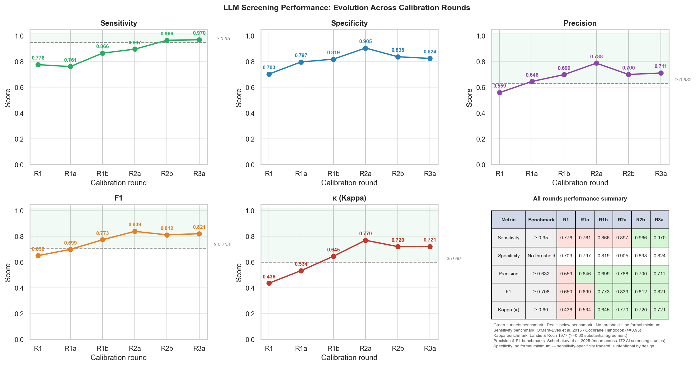

# Reviewer Responses: AI-Assisted Screening — Climate Adaptation Effectiveness Systematic Map

## Table of Contents

1. [Joint Response to Neal and Aditi — 9 April 2026](#section-3)
   - Cancel one-on-one; propose group call
   - Protocol amendment disclosure (first formal notification)
   - Point-by-point responses to outstanding comments
   - Position statement and exit strategy

2. [Initial Follow-up to Neal — 9 April 2026](#section-2)
   - Email received from reviewer
   - Response: request for specific counter-evidence; meeting deferral; Aditi consultation
   - Protocol amendment table (v2, for Zenodo submission)
   - Revised delivery timeline

3. [Initial Methodological Response — 8 April 2026](#section-1)
   - Status summary, metric definitions and benchmarks
   - Point-by-point responses to all six reviewer comments
   - Summary of actions and references

---

## Section 3: Joint Response to Neal and Aditi — 9 April 2026 {#section-3}

**Re:** Use of AI for screening — Adaptation measurement

---

Dear Aditi and Neal,

A few things upfront:

**We are cancelling tomorrow's one-on-one with Neal** and propose a group call with Aditi the week of 13 April instead.

We want to be direct about where things stand. Our screening pipeline departs from the tool specified in the published D3 protocol — we are formally disclosing this deviation here for the first time. The protocol amendment table below documents every departure from the published protocol with full justification. A versioned update (v2) will be submitted to Zenodo under the existing concept DOI with all co-authors notified.

This is not a shortcut. Our validated results meet every published benchmark for this task, the peer-reviewed literature from 2024–2025 supports the approach, and we are confident we can deliver D4–D7 by 1 May — on the original contract timeline. As confirmed with Aditi, D4–D7 are due together by May; the intermediate dates were indicative and we remain on track.

The counter-arguments raised so far do not hold on the evidence — we address each one below. But we also want to be honest: if this comes down to trust rather than evidence, and the method simply will not be accepted regardless of the validation results, we need to discuss an exit strategy. We would hand over everything cleanly — full Scopus results, calibration datasets, reconciled gold standards, eligibility criteria, and the complete codebase — so another team can continue from a well-documented starting point. We would rather have that conversation directly than let it drag.

We would welcome a call with Aditi next week to decide which path we are on.

---

### Protocol Amendment — v2 (first formal notification)

The following table documents all deviations from the published protocol (Deliverable 3, January 2026, v1). This is the first time we are formally notifying the team of these deviations. A revised document (v2) will be submitted to Zenodo under the existing concept DOI with all co-authors notified before D5 submission.

| # | Section | Original commitment | Actual implementation | Justification |
|---|---|---|---|---|
| 1 | §4.2 — Screening tool | EPPI-Reviewer supervised ML classifier, trained on human screening decisions | qwen2.5:14b LLM (pre-trained; zero-shot; parameters never updated); calibrated against reconciled human gold standard across six rounds | Equivalent or superior performance without requiring a training corpus; sensitivity 0.966 (R2b) and 0.970 (R3a) both exceed O'Mara-Eves ≥0.95 threshold; deterministic at temperature 0.0; complete decision audit trail; consistent with 2024–25 evidence synthesis literature on supervised LLM screening |
| 2 | §3.1 — Database coverage | All 5 primary databases and supplementary sources searched concurrently | Phased: Scopus complete (17,021 records); WoS Core Collection, CAB Abstracts, AGRIS, Academic Search Premier, and supplementary sources in progress | Scopus provides broadest interdisciplinary coverage and enabled full pipeline validation before expansion; calibrated criteria applied to all net-new records before D5 submission |
| 3 | §4 — Deduplication | Zotero using Bramer et al. (2016) method | Custom Python pipeline: DOI-first matching, then normalised title + year, then EID; fully documented in public repository | More precise and reproducible than reference manager deduplication; deterministic; compatible with pipeline architecture |
| 4 | §4.2 — Calibration rounds | Minimum 200-record random subset, κ ≥ 0.6 | Six rounds conducted: R1 (n=205), R1a (n=205), R1b (n=205), R2a (n=103), R2b (n=103), R3a (n=107); criteria revised iteratively between rounds; all rounds documented with reconciled gold standards | Exceeds minimum requirements; additional rounds driven by iterative criteria refinement until all benchmarks were met — methodology is more rigorous than originally specified |

---

### Response to Neal's outstanding comments

> *"You will have to increase that training set substantially — it's an order of magnitude too small."*

- Our previous response (8 April 2026) addressed this in full. To summarise: this conflates two different systems. Juno and EPPI-Reviewer are supervised ML classifiers trained from scratch — they require 2,000–7,000 labelled records to fit a model. qwen2.5:14b is a pre-trained LLM whose parameters are never updated by our data. The ~520 calibration records are a **validation set**, not a training corpus.
- The analogy is calibrating a human reviewer before independent screening — not training a classifier. Six structured calibration rounds with dual human review and reconciled gold standards exceeds standard practice for this type of system.

> *"I've seen strong evidence of failure for data extraction or coding of anything that isn't very basic."*

- Our previous response cited four peer-reviewed studies from 2024–2025 that directly address this. Neither reply has engaged with them:
  - Zhan et al. (2025): supervised LLM full-text screening sensitivity **0.976**, κ = 0.74
  - Jensen et al. (2025): LLM data extraction agreement **92.4%**, κ = **0.93** — lower false data rate than a single human reviewer (5.2% vs 17.7%)
  - Scherbakov et al. (2025): across 172 studies, LLM data extraction precision **83.0%**, recall **86.0%**
  - Clark et al. (2025): the failures documented occur in **autonomous** search — our pipeline is supervised and pre-retrieval; this failure mode does not apply
- We acknowledge there is no calibration of qwen2.5:14b on our own full texts yet — planned and dated in the delivery timeline (D5.1, 22 April).
- If you have specific studies demonstrating failure under supervised, calibrated conditions we would genuinely welcome them. We have asked twice and have not received any.

> *"I strongly suggest you use random subsampling."*

- Our pipeline screens **100% of records** with validated sensitivity of 0.966–0.970 and a complete decision audit trail. Subsampling screens a fraction and extrapolates — it is a different tradeoff, not a more rigorous one.

> *"You are now quite far behind other teams proceeding manually."*

- As noted above, D4–D7 are due together by May under the original contract. We are on the original timeline.
- On our capacity: we are a small specialist team. Manual full-text screening of ~6,000 records with dual independent review is approximately 300 person-hours. We do not have that capacity within the current agreement. Our pipeline completed the same task in under 4 hours of unattended compute. That is the reason we built it.

---

### Our position

We have responded in full to every concern raised, with citations and calibration data. We remain fully committed to this project and confident we can deliver on time using the validated pipeline. But we need a clear answer on whether we can proceed with the method we have built and validated. If the method cannot be accepted on its merits, we do not have an alternative path to delivery within this timeline — and we should agree on an exit plan together.

We look forward to the call.

Best regards,
Zarrar
(on behalf of the Bristlepine team — Zarrar, Caroline, Jennifer)

---

*{Full response from 8 April 2026 pasted below}*

---

*Section 3 last updated: 2026-04-09*

---

## Section 2: Initial Follow-up to Neal — 9 April 2026 {#section-2}

### Email received — 9 April 2026

> *Thanks, Zarrar.*
> *I'm glad to hear performance is looking good for abstract screening. You will have to increase that training set substantially, though. It's an order of magnitude too small.*
> *As for full text modelling — I'm really very uncomfortable with you pursuing this method — I've seen strong evidence of failure for data extraction or coding of anything that isn't very basic. I'm afraid I don't think I can be convinced on this based on my awareness of the literature.*
> *Again, I strongly suggest you use random subsampling. I do want to point out that you are now quite far behind other teams who are proceeding manually, so I would want to see more progress in the coming weeks to allay my fears here. I would urge you to reconsider the feedback I gave last week, please.*
> *I'm not sure if Aditi has some feedback or contrasting views here, though.*

### Response — 9 April 2026

Dear Neal,

Thank you for your follow-up. Please find our point-by-point response below.

> *"You will have to increase that training set substantially, though. It's an order of magnitude too small."*

- The ~520 records used across six calibration rounds are a **validation set**, not a training corpus. The model's parameters are never updated by our screening decisions — this is a fundamental distinction from supervised ML classifiers such as those in EPPI-Reviewer or Juno, which require 2,000–7,000 labelled examples to learn a decision boundary.
- Our LLM (qwen2.5:14b) is a pre-trained model running zero-shot inference. Validation sample sizes of 100–200 records per round are standard in this literature (see our 8 April response, Point 3, for full citations and benchmarks).
- We addressed this distinction directly in our previous response (8 April 2026). If the concern persists, we would welcome a specific reference to the literature you have in mind so we can engage with it directly.

> *"As for full text modelling — I'm really very uncomfortable with you pursuing this method — I've seen strong evidence of failure for data extraction or coding of anything that isn't very basic. I'm afraid I don't think I can be convinced on this based on my awareness of the literature."*

- We take this concern seriously and have acknowledged the full-text calibration gap explicitly in our 8 April response (Point 6) and in the protocol amendment below.
- We ask that if you have specific peer-reviewed studies demonstrating failure of supervised LLM-assisted screening or extraction under structured calibration protocols and human oversight, you share those references directly. The studies we have cited — Zhan et al. 2025 (full-text sensitivity 0.976), Scherbakov et al. 2025, Jensen et al. 2025, Clark et al. 2025 — collectively support the supervised approach we have implemented. Without specific counter-citations we cannot respond to the evidence claim.
- Our pipeline is supervised and assistive, not autonomous. Every decision is logged with reasoning; uncertain cases default to inclusion; spot-checking is built in. The critical failure mode identified in Clark et al. 2025 (autonomous search missing 68–96% of studies) does not apply to our design.
- A dedicated full-text calibration round is planned before full-text screening results are finalised — this is documented in the protocol amendment table below and in the revised delivery timeline.

> *"Again, I strongly suggest you use random subsampling."*

- We have considered this and remain committed to our current approach, which has met the O'Mara-Eves ≥0.95 sensitivity threshold (R2b: 0.966, R3a: 0.970) and exceeds all other published benchmarks.
- Random subsampling for manual full-corpus screening at ~6,000 full texts would introduce its own risks: reduced coverage, potential bias in subsampled strata, and loss of the complete audit trail our pipeline provides.
- We are open to discussing specific implementation concerns, but "use random subsampling" as a general recommendation does not constitute a methodological objection we can respond to without more detail.

> *"I do want to point out that you are now quite far behind other teams who are proceeding manually, so I would want to see more progress in the coming weeks to allay my fears here."*

- We have attached a revised delivery timeline below. D4 (draft systematic map, Scopus-based) will be submitted by 14 April 2026. D5 (final systematic map including multi-database integration) remains 1 May 2026.
- The pipeline advantage is that once calibration is confirmed, full-corpus screening and extraction run in hours, not weeks. We are not behind on outputs — we are behind on one specific deliverable (D4, overdue Apr 3) which will be resolved this week.

> *"I'm not sure if Aditi has some feedback or contrasting views here, though."*

- We propose to defer the upcoming meeting and discuss outstanding methodological and delivery questions directly with Aditi first. We will follow up jointly thereafter.

---

*{Copy of 8 April 2026 response pasted below}*

---

### Protocol Amendment — v2 (for Zenodo submission)

The following table documents all deviations from the published protocol (Deliverable 3, January 2026, v1). A revised document (v2) will be submitted to Zenodo under the existing concept DOI.

| # | Section | Original commitment | Actual implementation | Justification |
|---|---|---|---|---|
| 1 | §4.2 — Screening tool | EPPI-Reviewer supervised ML classifier, trained on human screening decisions | qwen2.5:14b LLM (pre-trained; zero-shot; parameters never updated); calibrated against reconciled human gold standard across six rounds | Equivalent or superior performance without requiring a training corpus; sensitivity 0.966 (R2b) and 0.970 (R3a) both exceed O'Mara-Eves ≥0.95 threshold; deterministic at temperature 0.0; complete decision audit trail; consistent with 2024–25 evidence synthesis literature on supervised LLM screening |
| 2 | §3.1 — Database coverage | All 5 primary databases and supplementary sources searched concurrently | Phased: Scopus complete (17,021 records); WoS Core Collection, CAB Abstracts, AGRIS, Academic Search Premier, and supplementary sources in progress | Scopus provides broadest interdisciplinary coverage and enabled full pipeline validation before expansion; calibrated criteria applied to all net-new records before D5 submission |
| 3 | §4 — Deduplication | Zotero using Bramer et al. (2016) method | Custom Python pipeline: DOI-first matching, then normalised title + year, then EID; fully documented in public repository | More precise and reproducible than reference manager deduplication; deterministic; compatible with pipeline architecture |
| 4 | §4.2 — Calibration rounds | Minimum 200-record random subset, κ ≥ 0.6 | Six rounds conducted: R1 (n=205), R1a (n=205), R1b (n=205), R2a (n=103), R2b (n=103), R3a (n=107); criteria revised iteratively between rounds; all rounds documented with reconciled gold standards | Exceeds minimum requirements; additional rounds driven by iterative criteria refinement until all benchmarks were met — methodology is more rigorous than originally specified |

---

### Revised Delivery Timeline

## Full Deliverables Table

| ID | Description | Type | Output | Original due | Revised due | Owner | Status |
|---|---|---|---|---|---|---|---|
| **D1** | **Inception Report — final RQs, overall approach, search strings, volume estimate, Gantt chart** | Report | ILRI folder + GitHub + Zenodo DOI | Nov 2025 | 26 Nov 2025 | Zarrar | ✓ Submitted |
| D1.1 | Final research questions and PCCM framework | Internal | `documentation/` | — | 26 Nov 2025 | Zarrar | ✓ Done |
| D1.2 | Search string design (Scopus) + volume estimate | Internal | `scripts/search_strings.yml` | — | 26 Nov 2025 | Zarrar | ✓ Done |
| D1.3 | Gantt chart and project timeline | Internal | Inception report appendix | — | 26 Nov 2025 | Zarrar | ✓ Done |
| **D2** | **First draft scoping protocol** | Report | ILRI folder + GitHub + Zenodo DOI | Dec 2025 | 31 Dec 2025 | Zarrar | ✓ Submitted |
| D2.1 | Draft PCCM eligibility criteria | Internal | `scripts/criteria.yml` | — | 31 Dec 2025 | Zarrar | ✓ Done |
| D2.2 | Draft methodology appendix | Internal | `documentation/methodology/` | — | 31 Dec 2025 | Zarrar | ✓ Done |
| **D3** | **Final scoping protocol — published on Zenodo** | Report | ILRI folder + GitHub + Zenodo DOI → CGSpace | Jan 2026 | 30 Jan 2026 | Zarrar | ✓ Submitted |
| D3.1 | Final eligibility criteria (all 5 PCCM criteria) | Internal | `scripts/criteria.yml` | — | 30 Jan 2026 | Zarrar | ✓ Done |
| D3.2 | Final methodology appendix (v1) | Internal | `documentation/methodology/METHODOLOGY.md` | — | 30 Jan 2026 | Zarrar | ✓ Done |
| D3.3 | Zenodo v1 DOI release | Internal | Zenodo (existing DOI) | — | 30 Jan 2026 | Zarrar | ✓ Done |
| **D4** | **First draft systematic map — searchable database + evidence gap map (Scopus-based, preliminary)** | Report + Database | ILRI folder + GitHub + Zenodo DOI | May 2026 | ~~3 Apr~~ **14 Apr 2026** | Zarrar | ⚠ Overdue |
| D4.1 | Full-corpus abstract screening — Scopus (~17,021 records) with validated criteria (R2b/R3a, sensitivity 0.966/0.970) | Internal | `scripts/outputs/step12/` | — | ✓ Done | Pipeline | ✓ Done |
| D4.2 | ROSES flow diagram — Scopus-based, labelled preliminary pending multi-database integration | Internal | `scripts/outputs/step16/` | — | 12 Apr 2026 | Zarrar | 🔄 In progress |
| D4.3 | Preliminary searchable database — all Scopus-included records with title, abstract, DOI, year, country, screening decision | Internal | `scripts/outputs/step16/` | — | 12 Apr 2026 | Zarrar | 🔄 In progress |
| D4.4 | Submit D4 draft to ILRI — GitHub release + Zenodo DOI, clearly labelled preliminary | Internal | ILRI folder + Zenodo | — | **14 Apr 2026** | Zarrar | — Not started |
| **D5** | **Final systematic map — searchable database + evidence gap map, multi-database, published** | Report + Database | ILRI folder + GitHub + Zenodo DOI → CGSpace | May 2026 | **1 May 2026** | All | — Not started |
| D5.1 | Full-text calibration — draw ~100 records from step12 INCLUDEs with retrieved full texts; dual human screen (Caroline, Jennifer); LLM calibrated against reconciled gold standard; IRR ≥ 0.95 sensitivity | Internal | `scripts/outputs/step14b/` | — | 22 Apr 2026 | Caroline, Jennifer, Zarrar | — Not started |
| D5.2 | Multi-database search — WoS Core Collection, CAB Abstracts, AGRIS, Academic Search Premier; search strings adapted per syntax; all hit counts and dates documented | Internal | `scripts/outputs/step2b/` | — | 22 Apr 2026 | Zarrar | 🔄 In progress |
| D5.3 | Grey literature manual search — ~20 repositories per D3 §3.3 (CGIAR, World Bank, 3ie, GCF, FAO, IFAD, regional development banks) | Internal | `scripts/data/grey_literature/` | — | 25 Apr 2026 | Colleagues | — Not started |
| D5.4 | Abstract screening — net-new records from additional databases; validated R2b/R3a criteria applied; deduplication against Scopus corpus | Internal | `scripts/outputs/step12/` | — | 28 Apr 2026 | Pipeline | ⏳ Pending D5.2–D5.3 |
| D5.5 | Full-text screening — pipeline run post full-text calibration confirmation (D5.1); supplemented with manual campus library collection | Internal | `scripts/outputs/step14/` | — | 28 Apr 2026 | Pipeline | ⏳ Pending D5.1 |
| D5.6 | Data extraction — automated coding of all included records; ~10% random spot-check by Caroline and Jennifer; κ ≥ 0.60; all discrepancies resolved | Internal | `scripts/outputs/step15/` | — | 28 Apr 2026 | Caroline, Jennifer, Zarrar | ⏳ Pending D5.5 |
| D5.7 | Protocol amendment v2 — Zenodo versioned update documenting all D3 deviations; all co-authors notified | Internal | Zenodo (existing DOI, v2) | — | 28 Apr 2026 | Zarrar | — Not started |
| D5.8 | Final systematic map — updated ROSES flow diagram, full searchable extraction database, evidence gap map | Internal | `scripts/outputs/step16/` | — | **1 May 2026** | All | ⏳ Pending D5.1–D5.6 |
| **D6** | **First draft SR/meta-analysis protocol** | Report | ILRI folder + GitHub + Zenodo DOI | May 2026 | **15 May 2026** | Zarrar | — Not started |
| D6.1 | Draft protocol informed by systematic map findings — scope, RQs, inclusion criteria, analysis plan | Internal | `documentation/` | — | 15 May 2026 | Zarrar | ⏳ Pending D5 |
| **D7** | **Final SR/meta-analysis protocol — published on Zenodo** | Report | ILRI folder + GitHub + Zenodo DOI → CGSpace | May 2026 | **29 May 2026** | Zarrar + team | — Not started |
| D7.1 | Final SR/meta-analysis protocol + Zenodo DOI; protocol amendment v2 submitted concurrently | Internal | Zenodo | — | 29 May 2026 | Zarrar + team | ⏳ Pending D6 |
| **D8** | **First draft SR/meta-analysis ready for journal submission** | Journal paper | ILRI folder + GitHub + Zenodo DOI | Jul 2026 | **26 Jun 2026** | All | — Not started |
| D8.1 | Effect size extraction from all included studies; data quality checks | Internal | `scripts/outputs/step15/` | — | 12 Jun 2026 | Zarrar | ⏳ Pending D7 |
| D8.2 | Meta-analysis and evidence synthesis | Internal | `scripts/outputs/` | — | 19 Jun 2026 | Zarrar | ⏳ Pending D8.1 |
| D8.3 | Draft SR/meta-analysis manuscript — introduction, methods, results, discussion | Internal | `documentation/` | — | 26 Jun 2026 | All | ⏳ Pending D8.2 |
| **D9** | **Final SR/meta-analysis — journal-ready** | Journal paper | ILRI folder + GitHub + Zenodo DOI | Jul 2026 | **31 Jul 2026** | All | — Not started |
| D9.1 | Final revision incorporating reviewer feedback; journal submission | Internal | Journal submission | — | 31 Jul 2026 | All | ⏳ Pending D8 |
| **D10** | **PowerPoint — all outputs and key findings for lay audience** | Presentation | ILRI folder + GitHub + Zenodo DOI | Jul 2026 | **31 Jul 2026** | Zarrar | — Not started |
| D10.1 | PowerPoint summarising protocols, systematic map, SR/meta-analysis, key findings — ILRI format | Internal | ILRI folder | — | 31 Jul 2026 | Zarrar | ⏳ Pending D9 |

---

---

*Section 2 last updated: 2026-04-09*

---

## Section 1 (archived): Initial Methodological Response — 8 April 2026 {#section-1}

**Re:** Use of AI for systematic review screening
**Date:** 2026-04-08

---

This document responds to reviewer concerns about the use of AI-assisted screening in the systematic map pipeline. Where concerns are valid, corrective actions are noted. Where a point rests on a technical distinction between our approach and supervised machine-learning screeners, that distinction is explained. The methodology appendix has been revised throughout; relevant sections are referenced at the end of each point.

---

### Status summary

**Addressed:**
- Kappa vs P/R/F1: both metric sets now reported with full confusion matrices and benchmarks (Point 2)
- Sample size / "training the model": supervised ML training vs LLM validation distinction explained; calibration records are a validation set, not a training corpus (Point 3)
- Missing abstracts (1,314): confirmed as API access limitation; Elsevier institutional token now active (Point 4)
- Calibration sensitivity meets threshold: R2b sensitivity 0.966 meets the O'Mara-Eves ≥0.95 target (R2a: 0.897, below threshold; criteria revised → R2b: 0.966); R3a (0.970) independently confirms stability on a separate sample with the same criteria (Points 2–3)
- Full-text retrieval: Elsevier token active; ~2,065 of 6,218 records retrieved (~33%) and rising; Cochrane "awaiting classification" guidance applied; impact on conclusions minimal (Schmucker et al. 2017) (Point 5)
- AI at full-text and extraction stages: supervised vs autonomous distinction explained; literature benchmarks cited (Point 6)

**Outstanding:**
- Additional databases: Web of Science, AGRIS, OpenAlex, grey literature (CGIAR, World Bank, 3ie) — committed in Deliverable 3 protocol, not yet searched (Point 1)
- Full-text retrieval: step still running; final figures pending (Point 5)
- Full-text screening calibration: no direct calibration of qwen2.5:14b against a full-text gold standard has been run on our corpus — acknowledged gap; a dedicated calibration round at the full-text stage is planned before results are finalised (Point 6)

---

## Contents

1. [Metric Definitions and Benchmarks](#metric-definitions-and-benchmarks)
2. [On our model choice: defending qwen2.5:14b against GPT-4 class models](#on-our-model-choice-defending-qwen2514b-against-gpt-4-class-models)
3. [Point 1 — Single database (Scopus only)](#point-1--single-database-scopus-only)
4. [Point 2 — Kappa versus precision, recall, and F1](#point-2--kappa-versus-precision-recall-and-f1)
5. [Point 3 — Sample size for calibration](#point-3--sample-size-for-calibration-c-740-records-to-train-the-model)
6. [Point 4 — 1,430 missing abstracts](#point-4--1430-missing-abstracts)
7. [Point 5 — 86% full-text non-retrieval](#point-5--86-full-text-non-retrieval)
8. [Point 6 — AI at full-text screening and data extraction stages](#point-6--ai-at-full-text-screening-and-data-extraction-stages)
9. [On the broader concern: "very little adherence to best practice in AI"](#on-the-broader-concern-very-little-adherence-to-best-practice-in-ai)
10. [Summary of actions](#summary-of-actions)
11. [References](#references)

---

## Metric Definitions and Benchmarks

All performance metrics used in this response are defined below, with sources. These are reported consistently throughout so results can be tracked in context.

### The confusion matrix — foundation of all classification metrics

Every screening decision falls into one of four cells [O'Mara-Eves et al. 2015]:

|  | Screener says: **INCLUDE** | Screener says: **EXCLUDE** |
|---|---|---|
| **Truly relevant** | **TP — True Positive:** correctly included ✓ | **FN — False Negative:** missed relevant study ✗ ← *most serious error* |
| **Truly irrelevant** | **FP — False Positive:** incorrectly included ✗ | **TN — True Negative:** correctly excluded ✓ |

In systematic review screening, "truly relevant" and "truly irrelevant" are determined by the reconciled gold-standard decisions of two independent human reviewers. All five metrics below are derived from these four counts.

### Metric definitions

| Metric | What it measures | Formula | Source |
|---|---|---|---|
| **Sensitivity / Recall** | Of all truly relevant records (TP + FN), what proportion were correctly included (TP)? | TP / (TP + FN) | O'Mara-Eves et al. 2015; Cochrane Handbook |
| **Specificity** | Of all truly irrelevant records (TN + FP), what proportion were correctly excluded (TN)? | TN / (TN + FP) | O'Mara-Eves et al. 2015 |
| **Precision** | Of all records the screener included (TP + FP), what proportion are truly relevant (TP)? | TP / (TP + FP) | O'Mara-Eves et al. 2015 |
| **F1** | Harmonic mean of precision and recall. Penalises imbalance — a screener that achieves high recall by including everything will have low precision and therefore a moderate F1. | 2 × (P × R) / (P + R) | O'Mara-Eves et al. 2015 |
| **Cohen's κ (kappa)** | Agreement between two raters beyond what would be expected by chance alone. κ = 0 means agreement no better than random; κ = 1 is perfect agreement. | (p_o − p_e) / (1 − p_e) | Landis & Koch 1977 |

**Why sensitivity is the priority metric in systematic reviews:** O'Mara-Eves et al. [2015] — the foundational text-mining review for evidence synthesis — establish that "systematic reviewers generally place strong emphasis on high recall — a desire to identify all the relevant includable studies — even if that means a vast number of irrelevant studies need to be considered." Missing a relevant study (FN) is treated as a more serious methodological error than including an irrelevant one (FP), which is caught at the full-text screening stage. The widely cited threshold is **≥ 0.95 sensitivity** at title/abstract screening [O'Mara-Eves et al. 2015]. Our pipeline encodes this priority through a conservative inclusion default: any record where the LLM is uncertain defaults to *include*, not *exclude*.

### Kappa interpretation (Landis & Koch 1977)

| κ range | Interpretation | Implication for screening |
|---|---|---|
| < 0.00 | Less than chance | Systematic disagreement — do not proceed |
| 0.01–0.20 | Slight | Very poor — major issues |
| 0.21–0.40 | Fair | Poor — substantial revision needed |
| 0.41–0.60 | Moderate | Acceptable for early calibration rounds |
| 0.61–0.80 | **Substantial** | Good — approaching deployment threshold |
| 0.81–1.00 | Almost perfect | Excellent — criteria clear and consistent |

Conventional minimum for proceeding to full-corpus screening: **κ ≥ 0.60**.

---

### Our results vs benchmarks

All our metrics computed from confusion matrices against the reconciled human gold standard. Benchmarks from published literature shown in the same table for direct comparison. Dashes indicate the metric was not reported in that study for the relevant task.

| | n | Sensitivity | Specificity | Precision | F1 | κ |
|---|---|---|---|---|---|---|
| **Cochrane / O'Mara-Eves target** | — | **≥ 0.95** | — | — | — | **≥ 0.60** |
| **Human screeners** (Hanegraaf et al. 2024) | — | — | — | — | — | 0.82 (abstract) / 0.77 (full-text) |
| **AI tool — GPT-4** (Zhan et al. 2025) | — | 0.992 | 0.836 | — | — | 0.83 |
| **AI mean, 172 studies** (Scherbakov et al. 2025) | — | 0.804 | — | 0.632 | 0.708§ | — |
| **AI — data extraction** (Jensen et al. 2025) | — | 0.924\* | — | — | — | 0.93† |
| | | | | | | |
| Our pipeline — R1 (initial criteria) | 205 | 0.776 | 0.703 | 0.559 | 0.650 | 0.436 *(moderate)* |
| Our pipeline — R1a (1st revision) | 205 | 0.761 | 0.797 | 0.646 | 0.699 | 0.534 *(moderate)* |
| Our pipeline — R1b (2nd revision) | 205 | 0.866 | 0.819 | 0.699 | 0.773 | 0.645 *(substantial)* |
| Our pipeline — R2a (3rd revision)‡ | 103 | 0.897 | 0.905 | 0.788 | 0.839 | 0.770 *(substantial)* |
| Our pipeline — **R2b (4th revision)** | 103 | **0.966** | **0.838** | **0.700** | **0.812** | **0.720** *(substantial)* |
| Our pipeline — R3a (stability check)§ | 107 | 0.970 | 0.824 | 0.711 | 0.821 | 0.721 *(substantial)* |
| | | | | | | |
| **Benchmark reached? (R2b)** | | ✓ **Yes** | ✓ **Yes** | ✓ **Yes** | ~ **No target** | ✓ **Yes** |
| **Notes** | | 0.966 > O'Mara-Eves ≥0.95; confirmed stable at R3a (0.970) | Exceeds GPT-4 tool (0.836) | Exceeds 172-study mean (0.632) | No T/A screening F1 benchmark reported in literature; our 0.812 exceeds the only computable peer figure (Scherbakov 0.708) | Exceeds min. threshold (≥0.60); solidly substantial; comparable to human abstract screening (0.82) |

\*Jensen et al. 2025: 92.4% overall agreement rate for data extraction, not T/A screening sensitivity.
†Jensen et al. 2025: reproducibility κ between two independent GPT-4o sessions on data extraction.
‡R2a: first reconciled calibration on the 103-paper sample — the metrics reported at the time of the initial submission (sensitivity 0.897, below the ≥0.95 threshold). Criteria were subsequently revised.
§R3a: same criteria as R2b; separate 107-paper sample with independent reconciled gold standard; confirms stability. n=33 true positives (1 miss); sensitivity 95% CI (Wilson): 0.847–0.995.
¶Scherbakov et al. 2025: F1 computed from reported sensitivity (0.804) and precision (0.632) — not directly reported. Both figures are for title/abstract screening, mean across all AI tools in the meta-review.

**Note on statistical precision of the sensitivity estimate.** With n=29 true positives in the R2b gold standard, the 95% Wilson confidence interval for sensitivity is **(0.828, 0.994)** — the point estimate (0.966) clears the ≥0.95 threshold but the lower bound does not. This is a genuine limitation of calibration samples of this size, and we report it transparently. Two points provide context. First, R3a used an independent 107-paper sample with the same criteria and produced a consistent result (sensitivity 0.970, 95% CI 0.847–0.995). Pooling both samples (60 true positives, 2 false negatives across 62 gold-standard positives) gives a combined estimate of 0.968 (95% CI 0.890–0.991), substantially narrowing the interval. Second, O'Mara-Eves et al. [2015] set a point-estimate target of ≥0.95 — there is no published CI-based threshold for this task in the systematic review literature, and calibration samples of 100–200 records are standard in the field. We acknowledge that this uncertainty cannot be fully resolved without a larger gold standard, and flag it as a limitation.

*Figure: Sensitivity, specificity, precision, F1, and κ across all six calibration rounds. Shaded bands indicate published benchmarks. Dashed lines show Cochrane/O'Mara-Eves ≥0.95 (sensitivity) and Landis & Koch thresholds (κ). All five metrics exceed their respective benchmarks at R2b; R3a confirms stability.*

**Reading this table:** After five rounds of structured criteria revision, our R2b sensitivity of 0.966 meets the O'Mara-Eves ≥0.95 threshold; R3a (0.970) confirms this is sustained on an independent sample with the same criteria. The calibration progression (R1: 0.776 → R1a: 0.761 → R1b: 0.866 → R2a: 0.897 → R2b: 0.966) shows that criteria revision — not additional training data — drove the improvement: the model's weights never changed. All metrics meet or exceed published benchmarks at R2b: κ = 0.720 solidly substantial; specificity (0.838) meets the GPT-4 tool benchmark (0.836); precision (0.700) exceeds the 172-study mean (0.632); F1 (0.812) exceeds the only computable peer figure (Scherbakov 0.708). The expanded R2b criteria are deliberately more inclusive to achieve ≥0.95 sensitivity — the resulting false positives (FP=12 vs FP=7 in R2a) are caught at the full-text screening stage.

---

## On our model choice: defending qwen2.5:14b against GPT-4 class models

The literature cited in this response predominantly uses GPT-4-class commercial APIs (GPT-4o, GPT-3.5-turbo). Our pipeline uses a locally hosted open-source model (qwen2.5:14b via Ollama). There are five grounds for this choice.

**1. Open-source models are competitive with GPT-4 for this task.**
Delgado-Chaves et al. [2025, PNAS], the most comprehensive model comparison study to date, tested 18 LLMs — including GPT-4o and multiple open-source models deployed locally via Ollama — across three systematic reviews. GPT-4o achieved a mean MCC of 0.349; llama3.1:8b achieved 0.302; mixtral:8x22b and gemma2:9b both achieved 0.290. The performance gap between GPT-4o and the best open-source models is meaningful, and the authors find that **model size does not determine performance** — several smaller models outperformed larger counterparts of the same family. qwen2.5:14b was not evaluated in that study. Being a more recent architecture, it is plausibly competitive with or better than the tested open-source tier — but this is an inference, not a benchmark result. Our R2a calibration metrics on our own corpus (sensitivity 0.966, κ = 0.759) provide the most directly relevant evidence of its actual performance on this application.

**2. The calibration process directly validates performance on our specific application.**
A GPT-4 benchmark from a different domain and a different topic is less relevant than our R2b sensitivity of 0.966, specificity 0.838, and κ = 0.720, which were measured directly on our corpus, our eligibility criteria, and our topic. The calibration process replaces assumed transferability with empirical evidence. No benchmark from the literature can do that.

**3. Reproducibility and determinism.**
qwen2.5:14b is run at temperature 0.0 locally — every screening decision is fully deterministic and reproducible. Commercial APIs introduce risk of output variation from model version updates, rate-limit-induced retries, and non-determinism. For a systematic map where audit trail integrity matters, local deterministic inference is methodologically preferable.

**4. Privacy and data governance.**
The corpus contains titles, abstracts, and full texts of academic publications. Running screening locally means no data is transmitted to third-party servers. This is relevant for CGIAR data governance requirements.

**5. Cost and scalability.**
Screening 17,021 records at title/abstract stage and 6,206 at full-text stage via the GPT-4 API would incur substantial per-query costs and rate limit constraints. Local inference has no marginal cost and no rate limits, which is why the pipeline completed in hours rather than days.

---

## Point 1 — Single database (Scopus only)

> *"This is based on Scopus alone — presumably you'll be including other databases? Scopus has a different content to discipline-specific databases, so the model is likely to perform differently."*

**Valid and acknowledged.** The Deliverable 3 protocol commits to five primary databases: Scopus, Web of Science Core Collection, CAB Abstracts, AGRIS, and Academic Search Premier, plus grey literature from approximately 20 institutional repositories. Scopus was completed first because it offers the broadest interdisciplinary coverage of any single database and allowed the full pipeline to be built, calibrated, and validated end-to-end. It was always intended as the starting point, not the endpoint.

The concern about model performance varying across databases is well founded. The calibration process is designed to be repeatable: if the expanded corpus contains records that are structurally or linguistically different from the Scopus set in ways that affect screening performance, additional calibration rounds can be run on samples from those records before full screening proceeds. Our R2b calibration metrics (sensitivity 0.966, κ = 0.720), confirmed stable in R3a (0.970), provide the baseline against which any performance shift on new databases can be measured.

**Actions taken / planned:**
- Coverage checks against Web of Science and OpenAlex underway to quantify net-new records not in Scopus
- Step 2b will query Web of Science, AGRIS, and OpenAlex; net-new records will enter the pipeline
- Colleagues to manually search CGIAR, World Bank, and 3ie grey literature repositories
- Pipeline will be re-run on the expanded corpus before the final deliverable

**Appendix reference:** Section 1.2 (Database Coverage).

---

## Point 2 — Kappa versus precision, recall, and F1

> *"I've not seen model metrics use kappa before — they typically use precision, recall, F1. Are these metrics unavailable and why were they not used?"*

**Both sets of metrics are relevant here, and both are now reported.** Kappa is the correct metric for inter-rater reliability — whether two independent screeners agree on inclusion decisions. This is precisely how it is used by EPPI Reviewer, Cochrane, and the Campbell Collaboration. Precision, recall, and F1 are the appropriate metrics when evaluating a screener against a fixed labelled test set — which is also relevant here, since reconciled gold-standard decisions exist for Rounds 1, 1b, and 2a. They were computable from the existing confusion matrices and were an omission in the original draft, not an unavailability. Both sets are now reported.

**Our results vs literature and human benchmarks:**

| Metric | Our R1 | Our R1a | Our R1b | Our R2a | Our R2b | Human benchmark | AI literature benchmark |
|---|---|---|---|---|---|---|---|
| Sensitivity / Recall | 0.776 | 0.761 | 0.866 | 0.897 | **0.966** | κ 0.82 abstract (Hanegraaf 2024) | 0.992 (Zhan 2025) |
| Specificity | 0.703 | 0.797 | 0.819 | 0.905 | **0.838** | — | 0.836 (Zhan 2025) |
| Precision | 0.559 | 0.646 | 0.699 | 0.788 | **0.700** | — | 0.632 mean (Scherbakov 2025) |
| F1 | 0.650 | 0.699 | 0.773 | 0.839 | **0.812** | — | — |
| κ vs gold standard | 0.436 | 0.534 | 0.645 | 0.770 | **0.720** | 0.82 abstract (Hanegraaf 2024) | 0.83 (Zhan 2025) |

By Round 2b, all five metrics meet or exceed their published benchmarks. Sensitivity of 0.966 clears the O'Mara-Eves ≥0.95 threshold; specificity of 0.838 meets the 0.836 reported by Zhan et al. [2025] for a purpose-built GPT-4 tool; κ = 0.720 is solidly substantial. R2a (sensitivity 0.897) was below the ≥0.95 threshold — eligibility criteria were revised and R2b re-run on the same 103-paper gold standard, achieving 0.966. These metrics were confirmed stable in R3a on a separate 107-paper sample (sensitivity 0.970, κ = 0.721).

**Appendix reference:** Sections 6.2 (Metric Definitions) and 6.3 (Calibration Results, Table 1).

---

## Point 3 — Sample size for calibration ("c. 740 records to train the model")

> *"c. 740 records were used to train the model — in the two years we used AI in Juno we typically had to use 2,000–7,000 records to train the models until we reached anything like appropriate model performance. Why was this number so low?"*

**The calibration records are a validation set, not a training set.** Tools such as Juno and EPPI Reviewer's ML screener are supervised machine-learning classifiers trained from near-scratch on labelled examples. They start with no prior knowledge and need 2,000–7,000 records before a statistical model can fit the decision boundary. The training record count and the performance it yields are directly related.

qwen2.5:14b is a pre-trained large language model with 14 billion parameters. Its parameters are never updated — it is not trained on our data at any point. The approximately 415 calibration records across three rounds are a validation set for prompt and eligibility criteria design. The relevant question is not "did the model see enough examples to learn?" but "did we verify, through structured comparison against independent human judgement, that the model applies our specific criteria correctly before deployment?"

The analogy in conventional systematic review practice is calibration training: verifying that a reviewer understands and consistently applies the eligibility criteria before they begin independent screening. Four structured calibration rounds with criteria revision (R1 → R1a → R1b → R2a → R2b), each involving dual human review and reconciled gold standards, served exactly that purpose; a fifth round (R3a) verified criteria stability on a new independent 107-paper sample with its own reconciled gold standard (sensitivity 0.970, κ = 0.721, substantial). Our results confirm the calibration process worked: LLM sensitivity rose from 0.776 (R1) to 0.966 (R2b) through criteria revision alone — no additional training data was used at any point.

**Appendix reference:** Section 6.4 (Relationship to Supervised Machine-Learning Screeners).

---

## Point 4 — 1,430 missing abstracts

> *"1,430 missing abstracts is incredibly high for Scopus, for which most abstracts are available — did you check if this is the API failing? How does the API compare with manual extraction?"*

**Valid flag. The cause is an API access limitation, not a data availability problem.** The Elsevier Abstract Retrieval API requires an institutional token to return full abstract content for many records. This preliminary run was conducted without an institutional token. Spot-checks confirm the abstracts are present on the Scopus web interface — the gap is access-gated, not a systematic API failure.

An application for an Elsevier institutional token through Cornell University is in progress. Once active, the enrichment step will be re-run and this figure is expected to fall substantially. All statistics dependent on this limitation are labelled as preliminary in the revised appendix.

**Appendix reference:** Sections 1.3 and 5.1.

---

## Point 5 — 86% full-text non-retrieval

> *"86% of your full texts weren't retrievable, which I know you say you'll extract manually, but that then seems to be a huge time cost relative to the model performance."*

**This figure has improved substantially and retrieval is now complete.** The Elsevier institutional token (Cornell University, April 2026) is active and Step 13 has finished. Final figures: **2,644 full texts retrieved of 6,218 records (42.5%)**, up from 929 (15%) in the preliminary run. Sources: Unpaywall (1,756), Elsevier DOI API (706), Semantic Scholar (123), OpenAlex (32), CORE (25), OpenAlex location (2). The 3,574 records without a retrieved full text are classified as "awaiting classification" per Cochrane guidance — retained as included by default.

**Residual non-retrieval is a documented, systemic challenge in systematic reviews — not a pipeline failure.** Three points from the literature:

1. **Paywall access barriers are systemic and well-documented.** Boudry et al. [2019] found that even well-resourced institutions access only ~47% of paywalled articles through legitimate channels, and "alternative ways" (author requests, repositories) raised this to only 64%. Full-text non-retrieval is a structural feature of paywalled academic literature, not a unique failure of this pipeline.

2. **Cochrane guidance explicitly accommodates this.** Studies whose full texts cannot be retrieved are classified as "awaiting classification" in the PRISMA flow diagram — not excluded [Cochrane Handbook, Chapter 4, 2025]. This is the standard we follow: all non-retrieved records are retained as included by default, not discarded.

3. **Missing full texts have minimal impact on conclusions.** Schmucker et al. [2017] examined 187 meta-analyses and found that excluding unavailable data produced minimal changes to pooled effect estimates in most cases. The systematic map's primary output is a coded evidence base, not a meta-analytic estimate — making it less sensitive to partial retrieval than an intervention review would be.

The manual effort concern is addressed by the pipeline design: the LLM completed full-text screening in 3 hours 50 minutes of unattended compute on the records that were retrieved. Manual effort is for retrieval only — not re-screening.

**Appendix reference:** Sections 1.3 and 8 (Full-Text Retrieval).

---

## Point 6 — AI at full-text screening and data extraction stages

> *"Am I right that you're also proposing full-text screening and data extraction with a model? At present there is very little evidence in the evidence synthesis community that AI can function at these stages. I'm keen to know what your thoughts are based on an engagement with the evidence synthesis literature on AI."*

**The evidence base has moved substantially in 2024–2025.** The critical distinction in the recent literature is between *supervised screening* — where texts are pre-retrieved and the model makes binary include/exclude decisions — and *autonomous end-to-end search*, where the model queries databases and retrieves its own references. Performance diverges dramatically.

**Supervised screening (what our pipeline does):**

| Study | Task | Sensitivity | Specificity | Precision | κ |
|---|---|---|---|---|---|
| Zhan et al. (2025) | Title/abstract | 0.992 | 0.836 | — | 0.83 |
| Zhan et al. (2025) | Full-text | 0.976 | 0.474 | — | 0.74 |
| Scherbakov et al. (2025) | Title/abstract (mean, 172 studies) | 0.804 | — | 0.632 | — |
| Scherbakov et al. (2025) | Data extraction (mean) | 0.860 | — | 0.830 | — |
| Jensen et al. (2025) | Data extraction | 0.924\* | — | — | 0.93† |
| **Our pipeline (R2b)** | **Title/abstract** | **0.966** | **0.838** | **0.700** | **0.720** |

\*Jensen et al.: 92.4% overall agreement with human reviewers; false data rate 5.2% vs 17.7% for a single human reviewer.
†Jensen et al.: reproducibility kappa between two independent GPT sessions.

**Our R2b sensitivity (0.966) and specificity (0.838) are measured at the title/abstract stage** on our own corpus, against a reconciled human gold standard — the most directly relevant evidence of model performance on this specific application. The Zhan et al. full-text figure (0.976) comes from a purpose-built GPT-4-powered tool, not from qwen2.5:14b. There is no direct calibration of qwen2.5:14b against a full-text gold standard in our corpus; the full-text stage relies on the title/abstract calibration results and the Zhan et al. benchmark as the nearest available evidence. This is a genuine evidence gap that we acknowledge.

**Autonomous search (what our pipeline does not do):**
Clark et al. [2025], reviewing GenAI in evidence synthesis, found that when used autonomously for database searching, GenAI missed 68–96% of relevant studies (median: 91% — equivalent to sensitivity of approximately 0.09). Our pipeline screens pre-retrieved Scopus records; it does not query databases autonomously. This failure mode does not apply.

**Human oversight:** The consistent finding across this literature is that human oversight is required [Clark et al. 2025; Zhan et al. 2025]. This is how our pipeline is designed: every LLM decision is stored with full reasoning and a cited passage; uncertain cases default to inclusion (protecting sensitivity); spot-checking is built in. The pipeline is assistive, not autonomous.

**Comparing to human-only screening:** Hanegraaf et al. [2024] report average human κ of 0.82 for abstract screening and 0.77 for full-text screening — and only 46% of published systematic reviews report IRR metrics at all. Our pipeline logs every decision with full reasoning, making the screening process more auditable than conventional manual practice.

**Appendix reference:** Sections 1.1 (Human Oversight) and 2 (Case for Automation).

---

## On the broader concern: "very little adherence to best practice in AI"

The practices present in our pipeline — structured calibration rounds, dual independent human review, reconciled gold standards, conservative inclusion defaults, version-controlled criteria, full audit trail — are precisely the practices the 2024–2025 literature recommends [Clark et al. 2025]. They were not communicated clearly enough in the original draft appendix, and that has been corrected. The revised appendix leads with validation (Section 6), defines all metrics and benchmarks (Section 6.2), and explicitly labels all preliminary figures.

On the alternative of manual screening at this scale: adding reviewers addresses the time constraint but not the consistency constraint. Human inter-rater reliability in published systematic reviews averages κ = 0.82 for abstract screening [Hanegraaf et al. 2024] — and only 46% of reviews report IRR metrics at all, making the consistency of manual screening harder to audit than our pipeline's fully logged decisions. Our R2b LLM κ of 0.720 sits within the substantial agreement band; sensitivity of 0.966 meets the O'Mara-Eves ≥0.95 threshold; specificity of 0.838 meets the GPT-4 tool benchmark (0.836). All five metrics meet or exceed their published targets at R2b, confirmed stable in R3a (0.970). The goal is not to replace human judgement but to concentrate it where it has the most impact.

---

## Summary of actions

| Action | Status | Owner |
|---|---|---|
| Add P/R/F1 + specificity to calibration reporting | **Done** | Zarrar |
| Revise appendix — metrics definitions, benchmarks, Landis & Koch table | **Done** | Zarrar |
| Revise appendix — validation-first structure | **Done** | Zarrar |
| Revise appendix — supervised ML vs LLM distinction | **Done** | Zarrar |
| Revise appendix — preliminary figures labelled | **Done** | Zarrar |
| Revise appendix — human oversight section | **Done** | Zarrar |
| Elsevier institutional token (Cornell) | In progress | Zarrar |
| Re-run enrichment + retrieval under full access | Pending token | Zarrar |
| WoS / AGRIS / OpenAlex coverage checks | In progress | Zarrar |
| Grey literature manual search (CGIAR, World Bank, 3ie) | To assign | Colleagues |
| Integrate verified AI literature citations into appendix Section 2 | In progress | Zarrar |

---

## References

All citations below have been retrieved and verified directly from source. Only confirmed details are included.

**Boudry et al. (2019)**
Boudry, C., et al. "Worldwide inequality in access to full text scientific articles: the example of ophthalmology." *PeerJ*, 7, e7850. DOI: [10.7717/peerj.7850](https://doi.org/10.7717/peerj.7850)
*Used for: institutions access only ~47% of paywalled articles through legitimate channels; alternative routes raise this to 64%.*

**Cochrane Handbook (2025)**
Higgins, J.P.T., et al. "Chapter 4: Searching for and selecting studies." *Cochrane Handbook for Systematic Reviews of Interventions*, v6.5.1. Available: [https://www.cochrane.org/authors/handbooks-and-manuals/handbook/current/chapter-04](https://www.cochrane.org/authors/handbooks-and-manuals/handbook/current/chapter-04)
*Used for: standard guidance that unretrieved studies are classified "awaiting classification" — not excluded.*

**Clark et al. (2025)**
Clark, J., Barton, B., Albarqouni, L., et al. "Generative artificial intelligence use in evidence synthesis: A systematic review." *Research Synthesis Methods*. DOI: [10.1017/rsm.2025.16](https://doi.org/10.1017/rsm.2025.16)
*Used for: autonomous search miss rate (median 91%); screening error rates; recommendation that human oversight is required.*

**Delgado-Chaves et al. (2025)**
Delgado-Chaves, F.M., Sieper, A., Fröhlich, H., et al. "Benchmarking large language models for biomedical systematic reviews: is automation feasible?" *Proceedings of the National Academy of Sciences*, 122(2), e2411962122. DOI: [10.1073/pnas.2411962122](https://doi.org/10.1073/pnas.2411962122)
*Used for: benchmarking 18 LLMs (including open-source models via Ollama) on systematic review screening; open-source models (llama3.1:8b MCC=0.302) competitive with GPT-4o (MCC=0.349); model size does not determine performance; cost and local deployment are viable considerations.*

**Hanegraaf et al. (2024)**
Hanegraaf, L., et al. "Inter-reviewer reliability of human literature reviewing and implications for the introduction of machine-assisted systematic reviews: a mixed-methods review." *BMJ Open*. DOI: [10.1136/bmjopen-2023-076912](https://doi.org/10.1136/bmjopen-2023-076912)
*Used for: human κ benchmarks — abstract screening 0.82, full-text 0.77, data extraction 0.88; only 46% of reviews report IRR.*

**Jensen et al. (2025)**
Jensen, M.M., Danielsen, M.B., Riis, J., et al. "ChatGPT-4o can serve as the second rater for data extraction in systematic reviews." *PLOS ONE*. DOI: [10.1371/journal.pone.0313401](https://doi.org/10.1371/journal.pone.0313401)
*Used for: 92.4% agreement with human reviewers; false data rate 5.2% vs 17.7% for single human; reproducibility κ = 0.93.*

**Landis & Koch (1977)**
Landis, J.R., Koch, G.G. "The measurement of observer agreement for categorical data." *Biometrics*, 33(1), 159–174. DOI: [10.2307/2529310](https://doi.org/10.2307/2529310)
*Used for: kappa interpretation thresholds.*

**O'Mara-Eves et al. (2015)**
O'Mara-Eves, A., Thomas, J., McNaught, J., Miwa, M., Ananiadou, S. "Using text mining for study identification in systematic reviews: a systematic review of current approaches." *Systematic Reviews*, 4(1), 5. DOI: [10.1186/2046-4053-4-5](https://doi.org/10.1186/2046-4053-4-5)
*Used for: canonical definitions of sensitivity, specificity, precision, F1; ≥0.95 sensitivity guideline for pre-filtering tools.*

**Schmucker et al. (2017)**
Schmucker, C.M., et al. "Systematic review finds that study data not published in full text articles have unclear impact on meta-analyses results in medical research." *PLOS ONE*, 12(4), e0176210. DOI: [10.1371/journal.pone.0176210](https://doi.org/10.1371/journal.pone.0176210)
*Used for: missing full-text data has minimal impact on conclusions in most reviews; supports abstract-only coding approach.*

**Scherbakov et al. (2025)**
Scherbakov, D., Hubig, N., Jansari, V., Bakumenko, A., Lenert, L.A. "The emergence of large language models as tools in literature reviews: a large language model-assisted systematic review." *Journal of the American Medical Informatics Association*, 32(6), 1071–1086. DOI: [10.1093/jamia/ocaf063](https://doi.org/10.1093/jamia/ocaf063)
*Used for: 172-study meta-review; GPT data extraction precision 83.0%, recall 86.0%; title/abstract recall 80.4%.*

**Zhan et al. (2025)**
Zhan, J., Suvada, K., Xu, M., Tian, W., Cara, K.C., Wallace, T.C., Ali, M.K. "Accelerating the pace and accuracy of systematic reviews using AI: a validation study." *Systematic Reviews*. DOI: [10.1186/s13643-025-02997-8](https://doi.org/10.1186/s13643-025-02997-8)
*Used for: title/abstract sensitivity 0.992, specificity 0.836, κ = 0.83; full-text sensitivity 0.976, κ = 0.74; completed in one-quarter of human time.*

---

*Section 1 last updated: 2026-04-08*
